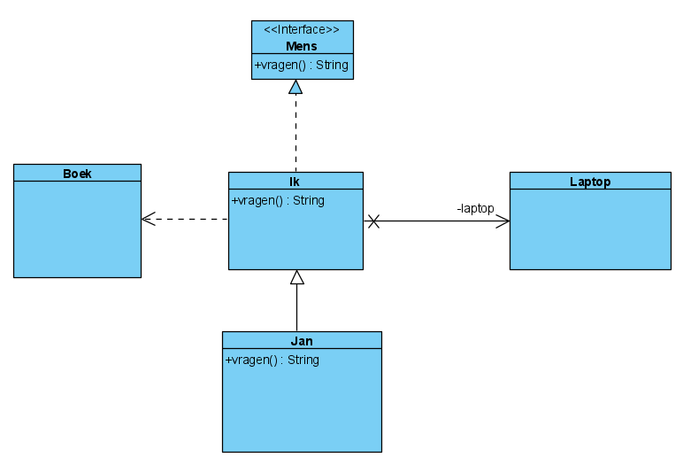
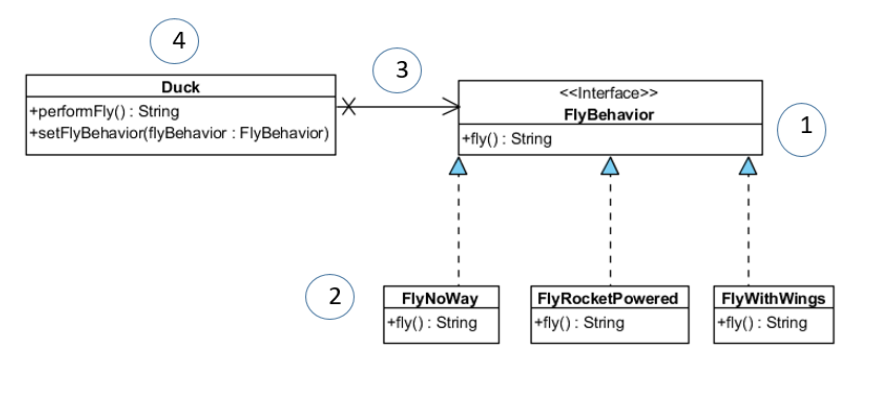
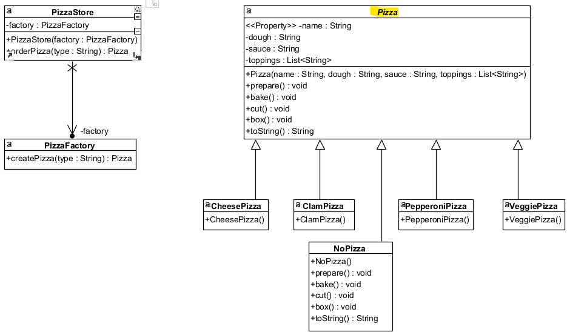
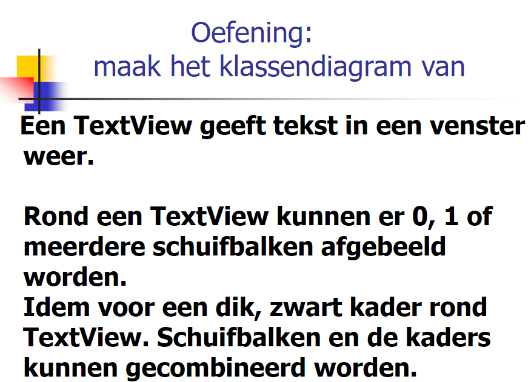
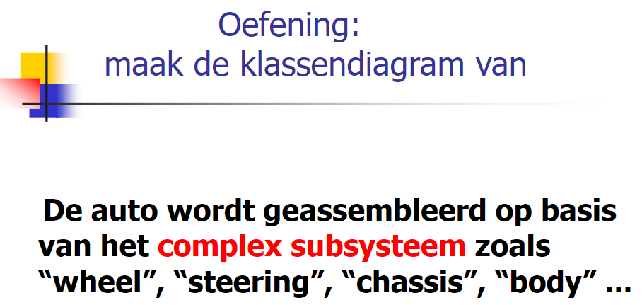
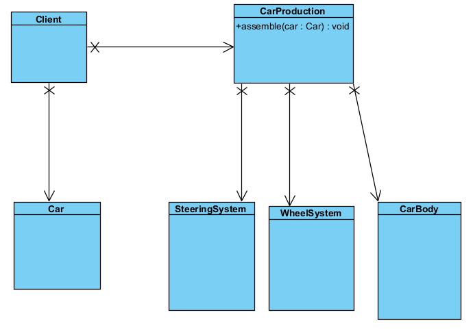
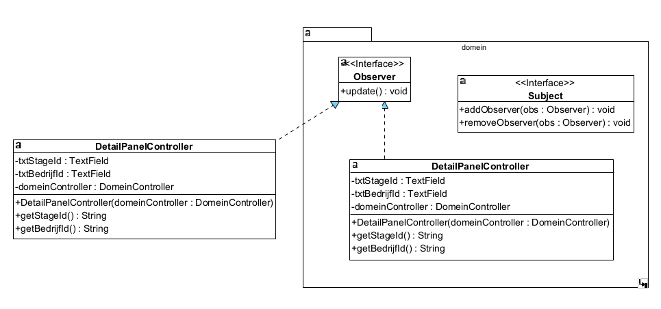
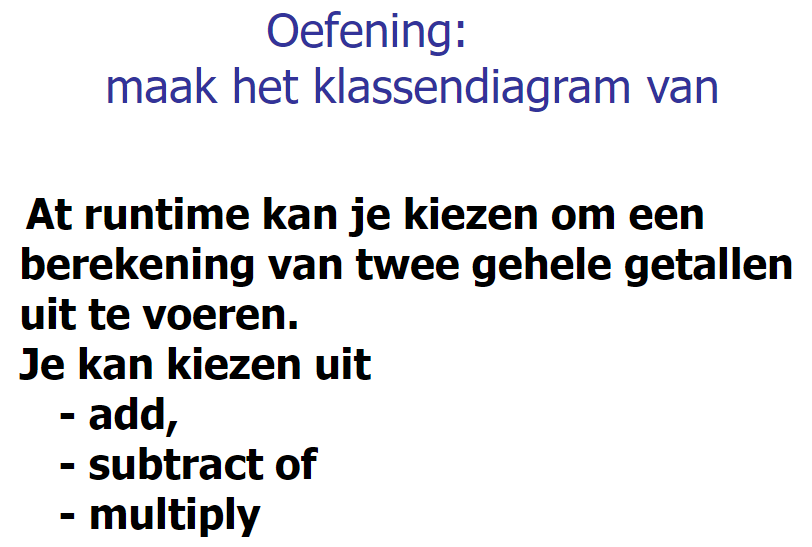
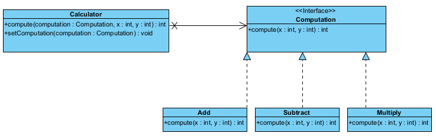

# ASDI

## Herhaling ontwerpen


#### Opgave: 

**Mens** definieert wat je met een **mens** kan doen.  
**Ik** ben een **mens**.  
**Ik** heb een **laptop**.  
Als je mij iets vraagt dan gebruik ik een **boek**.  
**Jan** kan mij altijd vervangen (dubbelganger) maar als je iets vraagt is het antwoord nogal kinderlijk.




## TDD
protected = is private + subklasses toegang geven, package access

### Oefening 1


#### Opgave:

Formaat: 3cijfers-7cijfers-2cijfers  
De rest van de deling eerste tien cijfers door 97 moet gelijk zijn aan de twee laatste cijfers.

#### Code:
Domeinklasse:
```java
package domein;

public class Rekening {
	private String rekeningnummer;

	public Rekening(String rekeningnummer) {
		setRekeningnummer(rekeningnummer);
	}

	private void setRekeningnummer(String rekeningnummer) {
		if (rekeningnummer == null || rekeningnummer.isBlank()) {
			throw new IllegalArgumentException("rekeningnummer niet ingevuld");
		}

		if (!rekeningnummer.matches("\\d{3}-\\d{7}-\\d{2}")) {
			throw new IllegalArgumentException("rekeningnummer in verkeerd formaat");
		}
		
		String[] token = rekeningnummer.split("-");
		long eerste10Cijfers = Long.parseLong(token[0] + token[1]);
		long laatste2Cijfers = Long.parseLong(token[2]);

		if (eerste10Cijfers % 97L != laatste2Cijfers)
			throw new IllegalArgumentException("verkeerde cijfers in rekeningnummer");

		this.rekeningnummer = rekeningnummer;	
	}
}
```
Testklasse:
```java
package testen;

import org.junit.jupiter.api.Assertions;
import org.junit.jupiter.params.ParameterizedTest;
import org.junit.jupiter.params.provider.NullAndEmptySource;
import org.junit.jupiter.params.provider.ValueSource;

import domein.Rekening;

class RekeningTest {
	
	@ParameterizedTest
	@ValueSource(strings = {"063-1547563-60", "999-9999999-48", "001-0000001-77"})

	public void geldRekeningnummer(String rekeningnummer) {
		Assertions.assertDoesNotThrow(()->{
			new Rekening(rekeningnummer);
		});
	}
	
	@ParameterizedTest
	@NullAndEmptySource
	@ValueSource(strings = {"063-1547563-61", " ", "063-1547563"})
	
	public void ongeldigeRekeningnummer(String rekeningnummer) {
		Assertions.assertThrows(IllegalArgumentException.class, ()->{
			new Rekening(rekeningnummer);
		});
	}
	
	
	/*@Test
	public void nummerOk() {
		Assertions.assertDoesNotThrow(()->{
			new Rekening("063-1547563-60");
		});
	}
	
	@Test
	public void grootNummerOk() {
		Assertions.assertDoesNotThrow(()-> {
			new Rekening("999-9999999-48");
		});
	}*/
}
```

### Oefening Bowling

#### Opgave

  
The game consists of 10 frames as shown above.  In each frame the player hastwo opportunities to knock down 10 pins.  The score for the frame is the totalnumber of pins knocked down, plus bonuses for strikes and spares.  
A spare is when the player knocks down all 10 pins in two tries. The bonus forthat frame is the number of pins knocked down by the next roll.  Soin frame 3above, the score is 10 (the total number knocked down) plus a bonus of 5 (thenumber of pins knocked down on the next roll.)  
A strike is when the player knocks down all 10 pins on his first try.  The bonusfor that frame is the value of the next two balls rolled.  
In the tenth frame a player who rolls a spare or strike is allowed to roll the extraballs to complete the frame.  However no more than three balls can be rolled intenth frame.  

Write a class named "BowlingGame" that has two methods:  
- **roll(pins : int)** is called each time the player rolls a ball.  The argument is the number of pins knocked down.
- **score() : int** is called only at the very end of the game.  It returns the total score for that game.

Create a class **BowlingGame** and test **BowlingGameTest**

#### Ontwerp:


#### Code
Domeinklasse:
```java
package domain;
public class BowlingGame {
	
	private int rolls[] = new int[21];
	private int currentRoll = 0;

	public void roll(int pins) {
		rolls[currentRoll++] = pins;
		
	}

	public int score() {
		int score = 0;
		for(int frameIndex = 0, frame = 0;frame<10; frameIndex+=2, frame++) 
			if(isStrike(frameIndex)) {
				score += 10 + strikeBonus(frameIndex);
				frameIndex--;
			}
			else if(isSpare(frameIndex))
				score += 10 + spareBonus(frameIndex);
			else
				score += sumOfPinsInFrame(frameIndex);
		return score;
	}
	
	private int sumOfPinsInFrame(int frameIndex) {
		return  rolls[frameIndex] + rolls[frameIndex+1];
	}
	
	private int strikeBonus(int frameIndex) {
		return rolls[frameIndex+1] + rolls[frameIndex+2];
	}
	
	private int spareBonus(int frameIndex) {
		return rolls[frameIndex+2];
	}
	
	private boolean isStrike(int frameIndex) {
		return rolls[frameIndex]==10;
	}

	private boolean isSpare(int frameIndex) {
		return rolls[frameIndex] + rolls[frameIndex + 1] == 10;
	}
}
```
Testklasse:
```java
package tests;

import org.junit.jupiter.api.Assertions;
import org.junit.jupiter.api.BeforeEach;
import org.junit.jupiter.api.Test;
import org.junit.jupiter.params.ParameterizedTest;
import org.junit.jupiter.params.provider.CsvSource;

import domain.BowlingGame;

class BowlingGameTest {
	
	private BowlingGame game;
	
	@BeforeEach
	public void before() {
		game = new BowlingGame();
	}
	
	private void rollMany(int n, int pins) {
		for(int i=0;i<n;i++) game.roll(pins);
	}
	
	private void rollSpare() {
		game.roll(5);
		game.roll(5);
	}
	
	private void rollStrike() {
		game.roll(10);
	}
	
	@ParameterizedTest
	@CsvSource({"0,0","1,20"})
	public void testSameNumberOfPins(int number, int expexted) {
		rollMany(20, number);
		Assertions.assertEquals(expexted, game.score());
	}
	
	@Test
	public void testOneSpare() {
		rollSpare();
		game.roll(3);
		rollMany(17, 0);
		Assertions.assertEquals(16, game.score());
	}
	
	@Test
	public void testTwoSpare() {
		rollSpare();
		rollSpare();
		game.roll(3);
		rollMany(15, 0);
		Assertions.assertEquals(31, game.score());
	}

	@Test
	public void testOneStrike() {
		rollStrike();
		game.roll(3);
		game.roll(4);
		rollMany(16, 0);
		Assertions.assertEquals(24, game.score());
	}
	
	@Test
	public void testAllStrikes() {
		for(int i = 0; i<12; i++) rollStrike();
		Assertions.assertEquals(300, game.score());
	}
	
	@Test 
	void testAllSpares_5_5() {
		for(int i = 0; i<10; i++) rollSpare();
		game.roll(5);
		Assertions.assertEquals(150, game.score());
	}
	
	@Test
	public void testScenario() {
		int[] pins = {1,4,4,5,6,4,5,5,10,0,1,7,3,6,4,10,2,8,6};
		for(int i=0; i<pins.length;i++) game.roll(pins[i]);
		Assertions.assertEquals(133, game.score());
	}
	
}
```

## Mockito


### Oplossing
De testen klassen
```java
package domein;

import persistentie.PersistentieController;

public class ContinentService {

	private static final int PER_1000_INWONERS = 1000;
	
	private PersistentieController persistentieController; //STAP1
	
	public ContinentService () { // STAP3
		this(new PersistentieController());
	}
	
	public ContinentService(PersistentieController persistentieController) { //STAP3
		this.persistentieController = persistentieController;
	}

	public double geefGeboorteOverschot(String continent) {
		if (continent == null || continent.isBlank()) {
			throw new IllegalArgumentException("continent moet ingevuld zijn");
		}
		//PersistentieController persistentieController = new PersistentieController(); //STAP4
		long aantalInwoners = persistentieController.findAantalBewoners(continent);
		if (aantalInwoners <= 0) {
			throw new IllegalArgumentException("geen inwoners gevonden voor gegeven continent");
		}

		long aantalSterfgevallen = persistentieController.findSterfteCijfer(continent);
		long aantalGeboorten = persistentieController.findGeboortecijfers(continent);
		if(aantalSterfgevallen<0|| aantalGeboorten<0) {
			throw new IllegalArgumentException();
		}

		double geboortecijfer = (double) aantalGeboorten / aantalInwoners * PER_1000_INWONERS;
		double sterftecijfer = (double) aantalSterfgevallen / aantalInwoners * PER_1000_INWONERS;

		return geboortecijfer - sterftecijfer;
	}
}
```

Testklasse
```java
package testen;

import static org.junit.jupiter.api.Assertions.*;

import java.util.stream.Stream;

import org.junit.Assert;
import org.junit.jupiter.api.Assertions;
import org.junit.jupiter.api.Test;
import org.junit.jupiter.api.extension.ExtendWith;
import org.junit.jupiter.params.ParameterizedTest;
import org.junit.jupiter.params.provider.Arguments;
import org.junit.jupiter.params.provider.MethodSource;
import org.junit.jupiter.params.provider.NullAndEmptySource;
import org.junit.jupiter.params.provider.ValueSource;
import org.mockito.InjectMocks;
import org.mockito.Mock;
import org.mockito.Mockito;
import org.mockito.junit.jupiter.MockitoExtension;

import domein.ContinentService;
import persistentie.PersistentieController;

@ExtendWith(MockitoExtension.class)
class ContinentServiceTest {
	@Mock
	private PersistentieController persistentController;
	@InjectMocks
	private ContinentService continentService;
	
	private static final String CODE = "Code";
	
	@Test
	public void testGeboorteOverschot() {
		//trainen
		dummyTrainen(16405399L, 184634L, 135136L);
		//assert en controle
		controle(3.01);
	}
	
	@Test
	public void testSterfteOverschot() {
		dummyTrainen(18506500L, 277597L, 333117L);
		controle(-3);
	}
	
	private void dummyTrainen(long aantalInwoners, long aantalGeboorten, long aantalStergevallen) {
		
		Mockito.lenient().when(persistentController.findAantalBewoners(CODE)).thenReturn(aantalInwoners);
		Mockito.lenient().when(persistentController.findGeboortecijfers(CODE)).thenReturn(aantalGeboorten);
		Mockito.lenient().when(persistentController.findSterfteCijfer(CODE)).thenReturn(aantalStergevallen);
	}
	
	private void controle(double verwachteResultaat) {
		double geboorteOverschot = continentService.geefGeboorteOverschot(CODE);
		Assertions.assertEquals(verwachteResultaat, geboorteOverschot, 0.01);
		Mockito.verify(persistentController).findAantalBewoners(CODE);
		Mockito.verify(persistentController).findGeboortecijfers(CODE);
		Mockito.verify(persistentController).findSterfteCijfer(CODE);
	}
	
	//100% cover
	@ParameterizedTest
	@NullAndEmptySource
	@ValueSource(strings = " ")
	public void legeSpatieNullContinent(String continent) {
		Assertions.assertThrows(IllegalArgumentException.class, 
				() -> continentService.geefGeboorteOverschot(continent));
	}
	
	//CSVsource werkt niet met long constante vb 123L
	//dus method source
	private static Stream<Arguments> opsommingOngeldigeWaarden(){
		return Stream.of(
				Arguments.of(0L, 100L, 100L), 
				Arguments.of(-1L, 100L, 100L),
				Arguments.of(100L, -1L, 100L),
				Arguments.of(100L, 100L, -1L));
	}
	
	@ParameterizedTest
	@MethodSource("opsommingOngeldigeWaarden")
	public void ongeldigeWaarden(long aantalInwoners, long aantalGeboorten, long aantalStergevallen) {
		dummyTrainen(aantalInwoners, aantalGeboorten, aantalStergevallen);
		Assert.assertThrows(IllegalArgumentException.class, 
				() -> continentService.geefGeboorteOverschot(CODE));
	}

	private static Stream<Arguments> randWaarden(){
		return Stream.of(
				Arguments.of(1L, 15L, 14L, 1000.0), 
				Arguments.of(30000L, 0L, 15020L, -500.66),
				Arguments.of(30000L, 15020L, 0L, 500.66),
				Arguments.of(1L, 0L, 0L, 0));
	}
	@ParameterizedTest
	@MethodSource("randWaarden")
	public void geldigeWaarden(long aantalInwoners, long aantalGeboorten, long aantalStergevallen, double verwachtResultaat) {
		dummyTrainen(aantalInwoners, aantalGeboorten, aantalStergevallen);
		controle(verwachtResultaat);
	}
}
```

## Collections

### Reductiebonnen


Gemakzuchtige statische fabrieksmethoden op de List, Set en Map interfaces laten je eenvoudig niet wijzigbare lijsten, sets en maps maken. Een verzameling wordt als niet wijzigbaar beschouwd als elementen niet kunnen worden toegevoegd, verwijderd of vervangen.
```java
public List<Reductiebon> getReductiebonLijst() {
	//return reductiebonLijst;
	return Collections.unmodifiableList(reductiebonLijst);
}
```

#### Vraag 1:  
Methode geefReductiebonCodes: een lijst van reductiebonCodes wordt teruggegeven waarvan de percentage hoger ligt dan het meegegeven percentage.
````java
public List<String> geefReductiebonCodes(int percentage) {
    return reductiebonLijst.stream()
        .filter(r -> r.getPercentage()>percentage)
        .map(Reductiebon::getReductiebonCode)
        .collect(Collectors.toList());
}
````

#### Vraag 2:  
Methode sorteerReductiebonnen: sorteer de lijst met reductiebonnen volgens oplopende percentage (van laag naar hoog), en bij gelijke percentage op reductiebonCode – alfabetisch omgekeerde volgorde. (De originele lijst van reductiebonnen is gewijzigd.)
````java
public void sorteerReductiebonnen() {
		reductiebonLijst.sort(Comparator.comparing(Reductiebon::getPercentage)
				.thenComparing(Comparator.comparing(Reductiebon::getReductiebonCode)
				.reversed()));
}
````

#### Vraag 3:
Methode geefGemPercVanBonnenInToekomst: geef het gemiddelde percentage terug van alle reductiebonnen die in de toekomst liggen (ter info: huidige datum: LocalDate.now() ).
````java
// VRAAG3
public double geefGemPercVanBonnenInToekomst() {
	return reductiebonLijst.stream() //Stream van reductiebonnen
			.filter(bon -> bon.getEinddatum().isAfter(LocalDate.now()))
			.mapToInt(Reductiebon::getPercentage) // IntStream
			.average().getAsDouble();
}
````

#### Vraag 4:
Methode geefUniekeEinddatums: geef alle unieke einddatums terug (m.a.w. geen dubbels), gesorteerd in stijgende volgorde.
```java
// VRAAG4
public List<LocalDate> geefUniekeEinddatums() {
	return reductiebonLijst.stream()
			.map(Reductiebon::getEinddatum)
			.sorted()
			.distinct()
			.collect(Collectors.toList());
}
```

#### Vraag 5:
Bekijk deze klasse en pas aan. Er is nog een encapsulatie lek.
```java
public Collection<Sporter> getSportersLijst() {
	return Collections.unmodifiableCollection(sportersLijst);
}
```

#### Vraag 6:
Methode geefEenSporterMetGegevenReductiebon: geeft een willekeurige sporter terug die de gegeven reductiebon bevat. Indien geen sporter aanwezig, dan wordt null teruggegeven.
```java
public Sporter geefEenSporterMetGegevenReductiebon(Reductiebon bon) {
	return sportersLijst.stream()
			.filter(sporter -> sporter.getReductiebonLijst().contains(bon)) //Stream<Sporters>
			.findAny() //Optional<Sporter>
			.orElse(null); 
}
```

#### Extra vraag 1
Methode geefAlleReductiebonnenMetKortingsPercentageX: geeft een lijst van alle Reductiebonnen met die één van de meegegeven kortingspercentages hebben.
Opgelet: Testmethode uncomment + aanvullen resultaatSet (ophalen uit bonnen)
```java
public List<Reductiebon> geefAlleReductiebonnenMetKortingsPercentageX(List<Integer> kortingspercentage) {
	return sportersLijst.stream()
			.map(Sporter::getReductiebonLijst)
			.flatMap(Collection::stream)
			.filter(bon -> kortingspercentage.contains(bon.getPercentage()))
			.collect(Collectors.toList());
}
```
```java
@Test
public void testVraagExtra1_reductiebonnenMetKorting() {
	// TODO	uncomment
	List<Reductiebon> bonnen = sporterBeheerder.geefAlleReductiebonnenMetKortingsPercentageX(List.of(10, 40));

	Set<String> resultaat = //TODO verzamel dereductieboncodes in een Set
		bonnen.stream().map(Reductiebon::getReductiebonCode)
		.collect(Collectors.toSet());
		
	Set<String> verwachteResultaat = new HashSet<>(Arrays.asList("R31", "R34", "R36", "R322"));
	//Assertions.assertEquals(verwachteResultaat, resultaat);
}
```

#### Extra vraag 2
Methode verwijderAlleSportersMetReductiebonMetPercX : zal alle sporters uit de originele lijst verwijderen die als korting het meegegeven percentage hebben.
Opgelet: Testmethode uncomment
```java
public void verwijderAlleSportersMetReductiebonMetPercX(int perc) {
	sportersLijst.removeIf(s -> s.getReductiebonLijst().stream()
			.anyMatch(bon -> bon.getPercentage()== perc));	
}
```

## Map

```Java
class Auteur {

    private String naam, voornaam;

    public Auteur(String naam, String voornaam) {
        setNaam(naam);
        setVoornaam(voornaam);
    }

    public String getNaam() {
        return naam;
    }

    public String getVoornaam() {
        return voornaam;
    }

    public void setNaam(String naam) {
        this.naam = naam;
    }

    public void setVoornaam(String voornaam) {
        this.voornaam = voornaam;
    }

    @Override
    public String toString() {
        return String.format("%s %s", naam, voornaam);
    }
}

public class OefMap_opgave {
    public OefMap_opgave() {
        // we zullen een hashmap gebruiken waarbij auteursid de sleutel is en
        // de waarde is naam en voornaam van Auteur.
        //Creëer de lege hashMap "auteursMap"; de sleutel is van type Integer, de waarde van type Auteur
        //----------------------------------------------------------------------------------
        Map<Integer, Auteur> auteursMap = new HashMap<>();
        
        //Voeg toe aan de hashmap: auteursID = 9876, naam = Gosling, voornaam = James
        //Voeg toe aan de hashmap: auteursID = 5648, naam = Chapman, voornaam = Steve
        //-------------------------------------------------------------------------------
        auteursMap.put(9876, new Auteur("Gosling", "James"));
        auteursMap.put(5648, new Auteur("Chapman", "Steve"));
        
        //Wijzig de voornaam van Chapman: John ipv Steve
        //----------------------------------------------
        auteursMap.get(5648).setVoornaam("John");
        
        //Komt de auteursID 1234 voor in de hashmap
        //-----------------------------------------
        if (auteursMap.containsKey(1234))
		System.out.println("auteursID 1234 komt voor\n");
        else
		System.out.println("auteursID 1234 komt niet voor\n");
         
        //Toon de naam en voornaam van auteursID 5648
        //-------------------------------------------
        
		Auteur auteur = auteursMap.get(5648);
		if (auteur != null)
			System.out.println(auteur);
         
        toonAlleAuteurs(auteursMap);

        //Alle auteursID's worden in stijgende volgorde weergegeven.
        //  1) de hashMap kopiëren naar een treeMap (= 1 instructie)
        //  2) roep de methode toonAlleSleutels op.
        //---------------------------------------------------------------
        Map<Integer, Auteur> treeMap = new TreeMap<>();
        toonAlleAuteurs(auteursMap);
        
    }

    public void toonAlleSleutels(Map<Integer, Auteur> map) {
        //Alle sleutels van de map worden op het scherm weergegeven.
        //---------------------------------------------------------------
    	map.keySet().forEach(System.out::println);
        System.out.println();
    }

    public void toonAlleAuteurs(Map<Integer, Auteur> map) {
        /*Alle gegevens van de map worden op het scherm weergegeven.
		Per lijn wordt een auteursnr, naam en voornaam weergegeven.*/
        //---------------------------------------------------------------
    	//NIET ZO -> OVERKILL
    	//map.entrySet().stream().forEach(entry -> System.out.printf("%d %s%n", entry.getKey(), entry.getValue()));
        map.forEach((auteursId, auteur) -> System.out.printf("%d %s%n",auteursId, auteur));
    	System.out.println();
    }

    public static void main(String args[]) {
        new OefMap_opgave();
    }
}
```
```Java
class CollectionOperaties {
    
    //methode verwijderOpLetter
    //-------------------------
	public static boolean verwijderOpLetter(List<String> list, char c) {
		return list.removeIf(elem -> elem.charAt(0)==c);
	}

    //methode verwijderSequence
    //-------------------------
	public static boolean verwijderSequence(List<String> list, String grens) {
		int first = list.indexOf(grens);
		if (first==-1) {
			return false;
		}
		int last = list.lastIndexOf(grens);
		list.subList(first, last).clear();
		return true;
		
	}

	//uitbreiding opgave Fruit   addOrdered
	//-------------------------------------
	public static boolean addOrdered(List<String> list, String fruit) {
		int index = Collections.binarySearch(list, fruit);
		if(index>=0) {
			return false;
		}
		list.add(index*-1,fruit);
		return true;
	}
}

public class OefFruit_opgave {

    public static void main(String args[]) {
        String kist[][] = {{"appel", "peer", "citroen", "kiwi", "perzik"},
        {"banaan", "mango", "citroen", "kiwi", "zespri", "pruim"},
        {"peche", "lichi", "kriek", "kers", "papaya"}};

        List<String> list = Stream.of(kist).flatMap(Arrays::stream).collect(Collectors.toList());
        String mand[];

        //Toon de inhoud van de array "kist"
        //----------------------------------
        System.out.println(Arrays.deepToString(kist));
        
        //Voeg de verschillende kisten samen in een ArrayList list.
        //--------------------------------------------------------


        CollectionOperaties.verwijderOpLetter(list, 'p');
        System.out.println("na verwijder letter ('p') :  " + list + "\n");

        CollectionOperaties.verwijderSequence(list, "kiwi");
        System.out.println("na verwijder sequence (kiwi) : " + list + "\n");
        
        //UITBREIDING
        list.sort(null);
        CollectionOperaties.addOrdered(list, "sapodilla");

        //Plaats het resultaat terug in een array mand en sorteer die oplopend.
        //---------------------------------------------------------------------
        mand = list.toArray(new String[0]);
        Arrays.sort(mand);

        //Toon de inhoud van de array "mand"
        //----------------------------------
        System.out.println(Arrays.toString(mand));
    }
}
```
```Java
public class OefFruitMap_opgave {

    public static void main(String args[]) {
        String kist[][] = {{"appel", "peer", "citroen", "kiwi", "perzik"},
        {"banaan", "mango", "citroen", "kiwi", "zespri", "pruim"},
        {"peche", "lichi", "kriek", "kers", "papaya"}};

        List<String> list = Stream.of(kist).flatMap(Arrays::stream).collect(Collectors.toList());
        Scanner in = new Scanner(System.in);

        //declaratie + creatie map
        //------------------------------
        Map<String, Double> fruitMap = new TreeMap<>();
                            
        /*Berg de fruit list van vorige oefeningen in een boom
        op zodat dubbels ge�limineerd worden.
        Er moet ook de mogelijkheid zijn de bijhorende prijs
        (decimale waarde) bij te houden.*/
        //------------------------------------------------------------
        list.forEach(fruit -> fruitMap.put(fruit, null));
        
        /*Doorloop de boom in lexicaal oplopende volgorde en vraag
        telkens de bijhorende prijs, die je mee in de boom opbergt.*/
        //------------------------------------------------------------
        //fruitMap.forEach(...);
        fruitMap.entrySet().stream().forEach(entry -> {
        	System.out.printf("Prijs van %s : ", entry.getKey());
        	double prijs = in.nextDouble();
        	entry.setValue(prijs);
        });
        
        
        /*Druk vervolgens de volledige lijst in twee
        kolommen (naam : prijs) in lexicaal oplopende volgorde af
        op het scherm.*/
        //------------------------------------------------------------
        fruitMap.forEach((fruit, prijs) -> System.out.printf("%s\t%.2f%n", fruit, prijs));       
    }
}
```

## Design Patterns

### Strategy Pattern
Het Strategy Patterndefinieert een familie algoritmen, isoleert ze en maakt ze uitwisselbaar. Strategy maakt het mogelijk om het algoritme los van de client die deze gebruikt, te veranderen.

#### Waarom
Indien het gedrag varieert, dan halen we het eruit. 

#### Voorbeeld
Eenden: niet alle eenden vliegen op dezelfde manier. Sommige vliegen niet. Het vlieggedrag varieert, dus we halen het eruit.

#### Stappen
1. Maak een interface, zet het gedrag erin
2. Maak de implementatieklassen. Zet het gedrag erin. Stippenlijn tekenen
3. De client klasse bevat de interface: pijl tekenen naar de interface
4. In de client klasse schrijven we
   1. De injectie: we kiezen hier bv voor een setter injectie
   2. Het gedrag

#### UML


#### Code
```java
//STAP 1
public interface FlyBehavior {
   public String fly();
}
```
```java
//STAP 2
public class FlyNoWay implements FlyBehavior{
   @Override
   public String fly() {
      return "Ik kan niet vliegen";
   }
}
```
```java
public class Duck {
   //STAP 3
   private FlyBehavior flyBehavior;
   
   //STAP4
   public void setFlyBehavior(FlyBehavior flyBehavior) {
      this.flyBehavior = flyBehavior;
   }
   
   public String performFly() {
      return flyBehavior.fly();
   }//einde stap 4
}  
```
### Oefening Strategy pattern
#### Opgave 

- Het spel draait rond een held
- Een held kan wapens gebruiken om aan te vallen. De verschillende wapens zijn: mes, geweer en handen. hij kan ook vechten met zijn handen, vandaar dat het ook als wapen kan worden beschouwd.
- Indien hij noch mes of geweer heeft, dan vecht hij met zijn handen. 
- Een held kan slechts één wapen tegelijk gebruiken.
- Een held kan tijdens het spel van wapen veranderen.
- Het resultaat van een aanval is afhankelijk van het gebruikte wapen.

Maak voor deze opgave een klassendiagram
Maak ook een voorbeeldimplementatie in Java

#### Ontwerp


#### Code

```java
public class Held {

	private Wapens wapen;
	
	public Held() {
		wapen = new Handen();
	}

	public void valAan() {
		wapen.valAan();
	}

	public void setWapen(Wapens wapen) {
		if (wapen!=null) {
			this.wapen = wapen;
		} else {
			this.wapen = new Handen();
		}
	}
}

```
```java
public interface Wapens {

	void valAan();
}
```
```java
//Dit is hetzelfde voor Mes en handen
public class Geweer implements Wapens {

	public void valAan() {
		System.out.println("Schiet!");
	}
}
```

### Simple factory pattern

#### UML



#### Code
```Java
public class PizzaStore {

    private PizzaFactory factory;

    public PizzaStore(PizzaFactory factory) {
        this.factory = factory;
    }

    public Pizza orderPizza(String type) {
        Pizza pizza;

        pizza = factory.createPizza(type);

        //if (pizza != null) {
            pizza.prepare();
            pizza.bake();
            pizza.cut();
            pizza.box();
        //}
        return pizza;
    }
}
```
```Java
public class PizzaFactory {

    public Pizza createPizza(String type) {

        return switch (type.toLowerCase()) {
            case "cheese" ->
                new CheesePizza();
            case "pepperoni" ->
                new PepperoniPizza();
            case "clam" ->
                new ClamPizza();
            case "veggie" ->
                new VeggiePizza();
            default ->
                //null;
            	new NoPizza();
        };
    }

}
```
```Java
public class CheesePizza extends Pizza {

    public CheesePizza() {
        super("Cheese Pizza", "Regular Crust", "Marinara Pizza Sauce",
                new ArrayList<>(Arrays.asList(new String[]{
            "Fresh Mozzarella",
            "Parmesan"})));
    }

}
```
```Java
public class NoPizza extends Pizza {

	public NoPizza() {
		super("No Pizza", "", "", new ArrayList<>());
	}

	@Override
	public void prepare() {}

	@Override
	public void bake() {}

	@Override
	public void cut() {}

	@Override
	public void box() {}

	@Override
	public String toString() {
		return "";
	}
}
```
#### Oefening

1) Verbeter het ontwerp: bv.
```Java
public MallardDuck(){
   setQuackBehavior(new Quack());
   setFlyBehavoir(new FlyWithWings());
}
```
We mogen NIET naar een implementatie programmeren!

Programmeer naar een interface, niet naar een implemntatie.

+ testklasse verder aanvullen

```Java
public class DecoyDuck extends Duck {

    /*public DecoyDuck() {
        setQuackBehavior(new MuteQuack());
        setFlyBehavior(new FlyNoWay());
    }*/
	
	public DecoyDuck(QuackBehavior quack, FlyBehavior fly) { //MEEGEVEN --> voor factory
		super(quack, fly); //NORMAAL GEBRUIK JE DE CTOR VAN DE SUPER, NIET SETTER
	}
    
    @Override
    public String display() {
        return "Ik ben een lokeend";
    }

}
```
```Java
public abstract class Duck {

    private QuackBehavior quackBehavior;

    private FlyBehavior flyBehavior;
    
    public Duck(QuackBehavior quack, FlyBehavior fly) {
    	setFlyBehavior(fly);
    	setQuackBehavior(quack);
    }
    ...
}
```
```Java
public class DuckFactory {

	public Duck createDuck(DuckSpecies specie) {

		return switch (specie) {
			case REDHEAD -> new RedheadDuck(new Quack(), new FlyWithWings());
			case MALLARD -> new MallardDuck(new Quack(), new FlyWithWings());
			case RUBBER -> new RubberDuck(new Squeak(), new FlyNoWay());
			case DECOY -> new DecoyDuck(new MuteQuack(), new FlyNoWay());
		};
        
	}
}
```
```Java
public enum DuckSpecies {
	DECOY, MALLARD, REDHEAD, RUBBER
}
```
```Java
class DuckTest {
    ...
	
	private DuckFactory duckFactory;
	
	@BeforeEach
	public void before() {
		duckFactory = new DuckFactory();
	}
	
	@ParameterizedTest
	@MethodSource("duckProvider")
	public void testDuck(DuckSpecies kind, String expectedDisplay, String expectedQuack, String expectedFly) {
		Duck duck = duckFactory.createDuck(kind);
		Assertions.assertEquals(expectedDisplay, duck.display());
		Assertions.assertEquals(expectedQuack, duck.performQuack());
		Assertions.assertEquals(expectedFly, duck.performFly());
	}
	
	...
}
```

2) Voeg het vlieggedrag "FlyRocketPowered" toe

Toon aan dat je het gedrag dynamisch kan wijzigen (testklasse verder aanvullen).
```Java
        @ParameterizedTest
	@MethodSource("duckProvider")
	public void wijzigAtRuntime(DuckSpecies kind) {
		Duck duck = duckFactory.createDuck(kind);
		duck.setFlyBehavior(new FlyRocketPowered());
		Assertions.assertEquals(flyRocketPowered, duck.performFly());
	}
```

### State pattern

#### Theorie

#### Oefening

##### Opdracht
Een document wordt enkel bewaard indien nodig: wanneer wijzigingen werden aangebracht.
Indien er wijzigingen werden aangebracht en het document werd nog niet bewaard -> toestand ‘Dirty’
Indien het document werd bewaard en er werden geen wijzigingen meer aangebracht -> toestand ‘Clean’

##### Code

### Design patterns door elkaar

#### Oefening 1



##### Oplossing


```java
public class ScrollBar extends VisualDecorator {

	public void draw() {
		System.out.println("scrollbar");
		visualComponent.draw();
	}

	public ScrollBar(VisualComponent visualComponent) {
		super(visualComponent);
	}
}
```

```java
public class Border extends VisualDecorator {

	private int width;

	public void draw() {
		System.out.printf("kader van %d dik%n", width);
		visualComponent.draw();
	}

	public Border(VisualComponent visualComponent, int width) {
		super(visualComponent);
		this.width=width;
	}
}
```

```java
public interface VisualComponent {

	void draw();
}
```

```java
public abstract class VisualDecorator implements VisualComponent {

	protected VisualComponent visualComponent;

	public VisualDecorator(VisualComponent visualComponent) {
		this.visualComponent = visualComponent;
	}
}
```

```java
public class TextView implements VisualComponent {

	public void draw() {
		System.out.println("textview");
	}
}
```

```java
public class main {

	public static void main(String[] args) {
		VisualComponent textView = new TextView();
		textView.draw();
		VisualComponent textView2 = new ScrollBar(new Border(new TextView(), 10));
		textView2.draw();
	}

}
```

#### Oefening 2



##### Oplossing


#### Oefening 6


##### Oplossing




#### Oefening 7



##### Oplossing 
