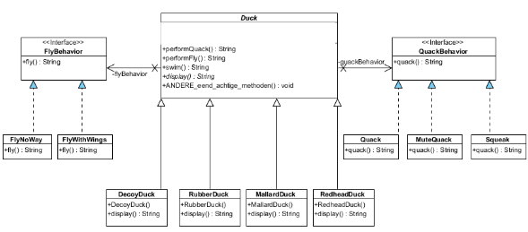
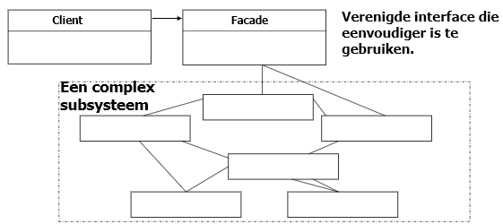
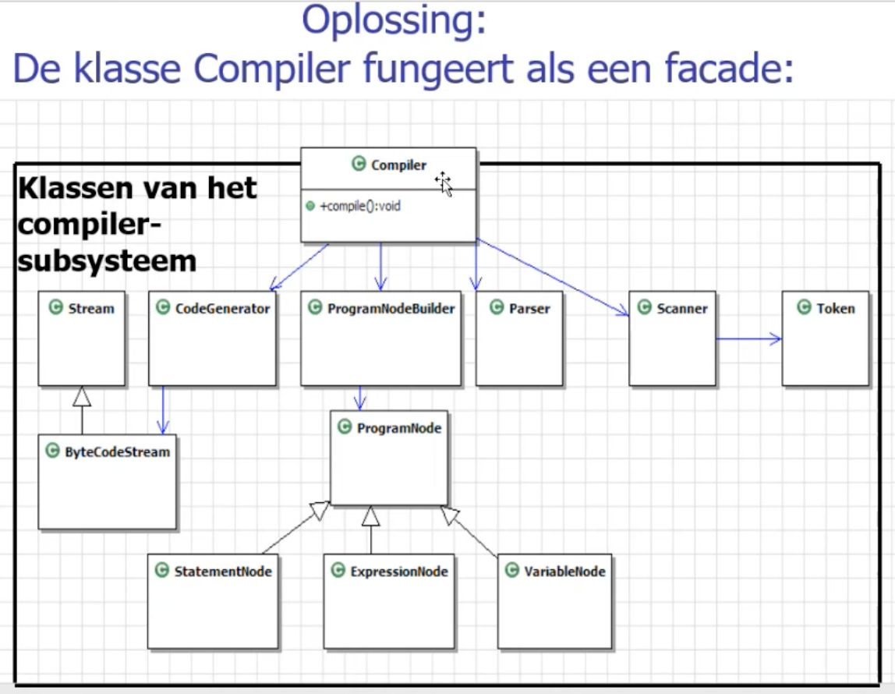
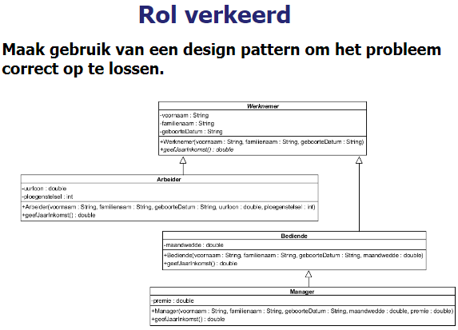
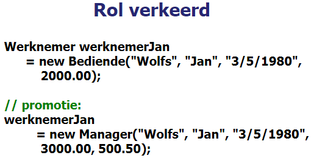
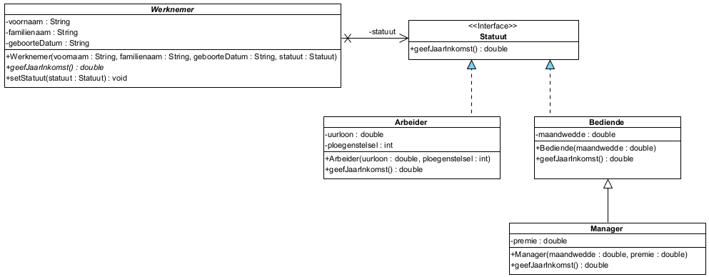
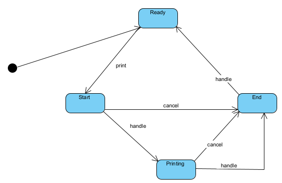
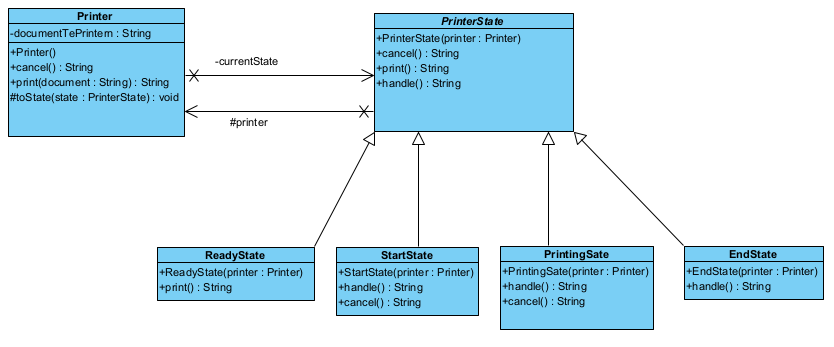
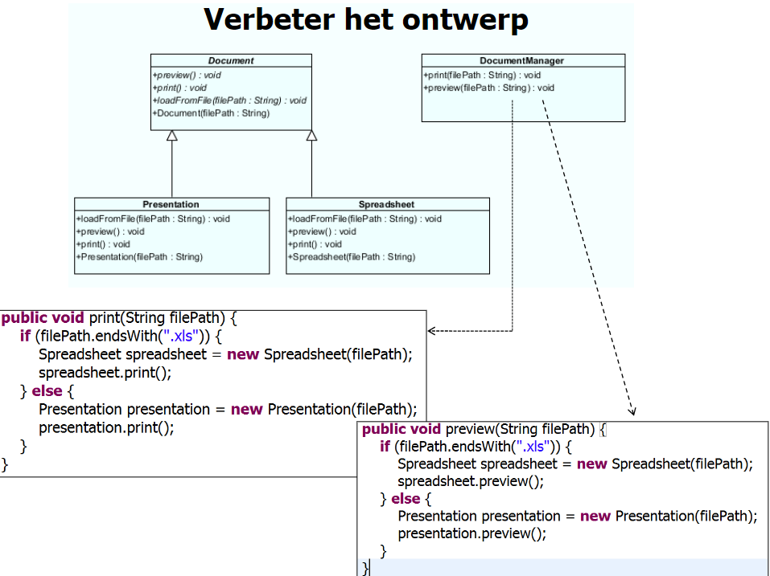
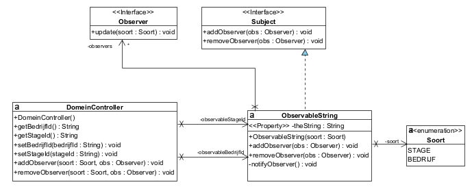

# Design Patterns

## Herhaling ontwerpen


### Opgave:

**Mens** definieert wat je met een **mens** kan doen.  
**Ik** ben een **mens**.  
**Ik** heb een **laptop**.  
Als je mij iets vraagt dan gebruik ik een **boek**.  
**Jan** kan mij altijd vervangen (dubbelganger) maar als je iets vraagt is het antwoord nogal kinderlijk.


## Strategy Pattern
Het Strategy Patterndefinieert een familie algoritmen, isoleert ze en maakt ze uitwisselbaar. Strategy maakt het mogelijk om het algoritme los van de client die deze gebruikt, te veranderen.

### Waarom
Indien het gedrag varieert, dan halen we het eruit.

### Voorbeeld
Eenden: niet alle eenden vliegen op dezelfde manier. Sommige vliegen niet. Het vlieggedrag varieert, dus we halen het eruit.

### Stappen
1. Maak een interface, zet het gedrag erin
2. Maak de implementatieklassen. Zet het gedrag erin. Stippenlijn tekenen
3. De client klasse bevat de interface: pijl tekenen naar de interface
4. In de client klasse schrijven we
    1. De injectie: we kiezen hier bv voor een setter injectie
    2. Het gedrag

### UML

Volledige UML


### Code
```java
//STAP 1
public interface FlyBehavior {
   public String fly();
}
```
```java
//STAP 2
public class FlyNoWay implements FlyBehavior{
   @Override
   public String fly() {
      return "Ik kan niet vliegen";
   }
}
```
```java
public class Duck {
   //STAP 3
   private FlyBehavior flyBehavior;
   
   //STAP4
   public void setFlyBehavior(FlyBehavior flyBehavior) {
      this.flyBehavior = flyBehavior;
   }
   
   public String performFly() {
      return flyBehavior.fly();
   }//einde stap 4
}  
```

### Oefening Strategy pattern
#### Opgave
- Het spel draait rond een held
- Een held kan wapens gebruiken om aan te vallen. De verschillende wapens zijn: **mes**, **geweer** en **handen**. hij kan ook vechten met zijn handen, vandaar dat het ook als wapen kan worden beschouwd.
- Indien hij noch mes of geweer heeft, dan vecht hij met zijn **handen**.
- Een held kan slechts **één wapen** tegelijk gebruiken.
- Een held kan tijdens het spel van **wapen veranderen**.
- Het resultaat van een aanval is afhankelijk van het gebruikte wapen.

Maak voor deze opgave een klassendiagram  
Maak ook een voorbeeldimplementatie in Java

#### Ontwerp


#### Code

```java
public class Held {

	private Wapens wapen;
	
	public Held() {
		wapen = new Handen();
	}

	public void valAan() {
		wapen.valAan();
	}

	public void setWapen(Wapens wapen) {
		if (wapen!=null) {
			this.wapen = wapen;
		} else {
			this.wapen = new Handen();
		}
	}
}

```
```java
public interface Wapens {

	void valAan();
}
```
```java
//Dit is hetzelfde voor Mes en handen
public class Geweer implements Wapens {

	public void valAan() {
		System.out.println("Schiet!");
	}
}
```

## Simple factory pattern

### Waarom
We willen de object creatie isoleren. We maken een factory klasse die object creatie afhandelt.

### Voorbeeld
Sommige pizza's zijn anders gemaakt. Je kan er verschillende toevoegen, wijzijgen of verwijderen zonder veel code te wijzgen.

### Stappen
1. Maak een factory klasse
2. Voeg een create method toe aan deze klasse. Deze returnt een object
3. De klasse die de factory gebruikt opnieuw bewerken

### UML


### Code
```Java
public class PizzaStore {

    private PizzaFactory factory;

    public PizzaStore(PizzaFactory factory) {
        this.factory = factory;
    }

    public Pizza orderPizza(String type) {
        Pizza pizza;

        pizza = factory.createPizza(type);

        //if (pizza != null) {
            pizza.prepare();
            pizza.bake();
            pizza.cut();
            pizza.box();
        //}
        return pizza;
    }
}
```
```Java
public class PizzaFactory {

    public Pizza createPizza(String type) {

        return switch (type.toLowerCase()) {
            case "cheese" ->
                new CheesePizza();
            case "pepperoni" ->
                new PepperoniPizza();
            case "clam" ->
                new ClamPizza();
            case "veggie" ->
                new VeggiePizza();
            default ->
                //null;
            	new NoPizza();
        };
    }

}
```
```Java
public class CheesePizza extends Pizza {

    public CheesePizza() {
        super("Cheese Pizza", "Regular Crust", "Marinara Pizza Sauce",
                new ArrayList<>(Arrays.asList(new String[]{
            "Fresh Mozzarella",
            "Parmesan"})));
    }

}
```
```Java
public class NoPizza extends Pizza {

	public NoPizza() {
		super("No Pizza", "", "", new ArrayList<>());
	}

	@Override
	public void prepare() {}

	@Override
	public void bake() {}

	@Override
	public void cut() {}

	@Override
	public void box() {}

	@Override
	public String toString() {
		return "";
	}
}
```
### Oefening

1) Verbeter het ontwerp: bv.
```Java
public MallardDuck(){
   setQuackBehavior(new Quack());
   setFlyBehavoir(new FlyWithWings());
}
```
We mogen NIET naar een implementatie programmeren!

Programmeer naar een interface, niet naar een implementatie. 

+ testklasse verder aanvullen

```Java
public class DecoyDuck extends Duck {

    /*public DecoyDuck() {
        setQuackBehavior(new MuteQuack());
        setFlyBehavior(new FlyNoWay());
    }*/
	
	public DecoyDuck(QuackBehavior quack, FlyBehavior fly) { //MEEGEVEN --> voor factory
		super(quack, fly); //NORMAAL GEBRUIK JE DE CTOR VAN DE SUPER, NIET SETTER
	}
    
    @Override
    public String display() {
        return "Ik ben een lokeend";
    }

}
```
```Java
public abstract class Duck {

    private QuackBehavior quackBehavior;

    private FlyBehavior flyBehavior;
    
    public Duck(QuackBehavior quack, FlyBehavior fly) {
    	setFlyBehavior(fly);
    	setQuackBehavior(quack);
    }
    ...
}
```
```Java
public class DuckFactory {

	public Duck createDuck(DuckSpecies specie) {

		return switch (specie) {
			case REDHEAD -> new RedheadDuck(new Quack(), new FlyWithWings());
			case MALLARD -> new MallardDuck(new Quack(), new FlyWithWings());
			case RUBBER -> new RubberDuck(new Squeak(), new FlyNoWay());
			case DECOY -> new DecoyDuck(new MuteQuack(), new FlyNoWay());
		};
        
	}
}
```
```Java
public enum DuckSpecies {
	DECOY, MALLARD, REDHEAD, RUBBER
}
```
```Java
class DuckTest {
    private final static String FLY_NO_WAY = "Ik kan niet vliegen";
	private final static String FLY_WITH_WINGS = "Ik vlieg!!";
	private final static String QUACK = "Ik kwaak";
	private final static String SQUEAK = "Piep";
	private final static String MUTE_QUACK = "<<Stilte>>";

	private final String flyRocketPowered = "Ik vlieg met raketaandrijving";

	private DuckFactory duckFactory;
	
	@BeforeEach
	public void before() {
		duckFactory = new DuckFactory();
	}

	private static Stream<Arguments> duckProvider() {
		return Stream.of(Arguments.of(MALLARD, "Ik ben een echte wilde eend", QUACK, FLY_WITH_WINGS),
				Arguments.of(RUBBER, "Ik ben een badeend", SQUEAK, FLY_NO_WAY),
				Arguments.of(REDHEAD, "Ik lijk op een roodkuifeend", QUACK, FLY_WITH_WINGS),
				Arguments.of(DECOY, "Ik ben een lokeend", MUTE_QUACK, FLY_NO_WAY));
	}
	
	@ParameterizedTest
	@MethodSource("duckProvider")
	public void testDuck(DuckSpecies kind, String expectedDisplay, String expectedQuack, String expectedFly) {
		Duck duck = duckFactory.createDuck(kind);
		Assertions.assertEquals(expectedDisplay, duck.display());
		Assertions.assertEquals(expectedQuack, duck.performQuack());
		Assertions.assertEquals(expectedFly, duck.performFly());
	}
	...
}
```

2) Voeg het vlieggedrag "FlyRocketPowered" toe

Toon aan dat je het gedrag dynamisch kan wijzigen (testklasse verder aanvullen).
```Java
        @ParameterizedTest
	@MethodSource("duckProvider")
	public void wijzigAtRuntime(DuckSpecies kind) {
		Duck duck = duckFactory.createDuck(kind);
		duck.setFlyBehavior(new FlyRocketPowered());
		Assertions.assertEquals(flyRocketPowered, duck.performFly());
	}
```

## Observer Pattern

### Waarom
Wanneer we willen dat bij een update van een bepaald opbject, andere objecten ook geüpdated worden.

### Voorbeeld
We meten de temperatuur, luchtvochtigheid en de luchtdruk en geven ze wveer op het scherm. Deze veranderen constant en bij elke verandering moeten de schermen geüpdated worden. Subject = weatherData, observer = schermen.

### Stappen
1. Maak de interfaces Subject, Observer en DisplayElement aan.
2. Geef aan de observer ook de paramters die hij moet observeren
3. Maak de concrete subject klasse aan, deze implementeert subject en voeg de methodes addObserver, removeObserver en notifyObserver toe. De observers worden hier in een set opgeslagen. 
4. Maak de schermelementen aan, deze implementeren observer en displayElement. Zij hebben een update en een display methode. In de constructor wordt het observerObject overgedragen aan het object. 

### UML


### Code
```java
//STAP 1
public interface Subject {

    public void addObserver(Observer observer);

    public void removeObserver(Observer observer);
}
public interface Observer {
   //STAP 2
    public void update(double temp, double humidity, double pressure);
}
package gui;

public interface DisplayElement {

    public void display();
}

```
```java 
//STAP 3
public class WeatherData implements Subject {

    private double temperature, humidity, pressure;

    private Set<Observer> observers;

    public WeatherData() {
        observers = new HashSet<>();
    }

    public double getHumidity() {

        return humidity;
    }

    public double getPressure() {
        return pressure;
    }

    public double getTemperature() {
        return temperature;
    }

    public void setMeasurements(double temperature, double humidity, double pressure) {
        this.temperature = temperature;
        this.humidity = humidity;
        this.pressure = pressure;
        notifyObservers();
    }

    @Override
    public void addObserver(Observer observer) {
        observers.add(observer);
    }

    @Override
    public void removeObserver(Observer observer) {
        observers.remove(observer);
    }

    private void notifyObservers() {
        observers.forEach(observer
                -> observer.update(temperature, humidity, pressure));
    }
}
```
```java 
//STAP 4
public class CurrentConditionsDisplay implements Observer, DisplayElement {

    private Subject weatherData;
    private double temperature, humidity;

    public CurrentConditionsDisplay(Subject weatherData) {
        this.weatherData = weatherData;
        weatherData.addObserver(this);
    }

    public void update(double temp, double humidity, double pressure) {
        this.temperature = temp;
        this.humidity = humidity;
        display();
    }

    public void display() {
        System.out.printf("Actuele weergesteldheid %.1f graden en %.1f %% luchtvochtigheid\n",
                temperature, humidity);
    }
}
```
```java 
public class ForecastDisplay implements Observer, DisplayElement {

    private double currentPressure = 29.92f;
    private double lastPressure;
    private Subject subject;

    public ForecastDisplay(Subject subject) {
        this.subject = subject;
        subject.addObserver(this);
    }

    public void update(double temp, double humidity, double pressure) {
        lastPressure = currentPressure;
        currentPressure = pressure;

        display();
    }

    public void display() {
        System.out.print("Weersverwachting: ");
        if (currentPressure > lastPressure) {
            System.out.println("Beter weer op komst!");
        } else if (currentPressure == lastPressure) {
            System.out.println("Meer van hetzelfde");
        } else if (currentPressure < lastPressure) {
            System.out.println("Koeler, regenachtig weer op komst");
        }
    }
}
```
```java 
public class StatisticsDisplay implements Observer, DisplayElement {

    private double maxTemp = 0.0f;
    private double minTemp = 200;
    private double tempSum = 0.0f;
    private int numReadings;
    private Subject subject;

    public StatisticsDisplay(Subject subject) {
        this.subject = subject;
        subject.addObserver(this);
    }

    public void update(double temp, double humidity, double pressure) {
        tempSum += temp;
        numReadings++;

        if (temp > maxTemp) {
            maxTemp = temp;
        }

        if (temp < minTemp) {
            minTemp = temp;
        }

        display();
    }

    @Override
    public void display() {
        System.out.printf("Gem/Max/Min temperature = %.1f/%.1f/%.1f\n",
                (tempSum / numReadings), maxTemp, minTemp);
    }
}
```

## Decorator Pattern

### Waarom
We hebben veel mogelijkheden die een bepaald object kan gebruiken, maar we willen ons project niet nodeloos complex maken. Elke decoratie heeft een invloed op het object.

### Voorbeeld
We runnen een koffieshop, en elke soort drank kan gedecoreerd worden met verschillende items. De prijs is afhankelijk van welke decoraties je erbij neemt.

### Stappen
1. Maak een abstracte klasse met een abstracte methode
2. Maak alle hoofdklasses aan, zij extenden telkens de abstracte klasse
3. Maak een abstracte decorator klasse aan die de eerste abstracte klasse extenden. Protected methode niet vergeten.
4. Alle decoraties krijgen hun eigen klasse die de decorator klasse extenden. (Deze krijgen ook de abstracte methode van in het begin mee)

### UML


### Code
```java 
//STAP 1
public abstract class Beverage {

    private String description = "Unknown Beverage";
    
    public String getDescription() {
        return description;
    }

    protected void setDescription(String description) {
        this.description = description;
    }

    public abstract double cost();
}
```
Zelfde voor DarkRoast, Decaf, Houseblend:
```java 
//STAP 2
public class Espresso extends Beverage {

    public Espresso() {
        setDescription("Espresso");
    }

    @Override
    public double cost() {
        return 1.99;
    }
}
```
```java 
//STAP 3
public abstract class CondimentDecorator extends Beverage {

    private final Beverage beverage;

    public CondimentDecorator(Beverage beverage) {
        this.beverage = beverage;
    }

    protected Beverage getBeverage() {
        return beverage;
    }

    @Override
    public abstract String getDescription();
}
```
Zelfde voor Mocha, Soy, Whip
```java 
//STAP 4
public class Milk extends CondimentDecorator {

    public Milk(Beverage beverage) {
        super(beverage);
    }

    @Override
    public String getDescription() {
        return getBeverage().getDescription() + ", Milk";
    }

    @Override
    public double cost() {
        return .10 + getBeverage().cost();
    }
}
```
### Oefening


#### Oplossing


```java
public abstract class ReaderDecorator implements Reader {

	protected final Reader reader;
	
	public ReaderDecorator(Reader reader) {
		this.reader = reader;
	}
}
```
```java 
public class FileReader implements Reader {

	public FileReader(String Filenaam) {
		
	}

	public FileReader(File file) {
		
	}

	public String read() {
		return "tekst";
	}
}
```
```java 
public interface Reader {
	public String read();
}
```
Analoog voor encryptedReader:
```java 
public class ZipReader extends ReaderDecorator {

	public ZipReader(Reader reader) {
		super(reader);
	}

	public String read() {
		return String.format("zip %s", reader.read());
	}
}
```

## State Pattern

### Waarom
Een object dat verschillende toestanden heeft wordt snel complex als je de toestand als variabele bijhoudt. Daarom maak je voor het object een abstracte toestandsklasse en de verschillende toestanden zijn klassen deze extenden.

### Voorbeeld
Een kauwgumbalautomaat heeft verschillende toestanden(hasQuarter, hasNoQuarter, outOfGumballs, Sold...). Je klasse is slecht uitbreidbaar als je deze toestanden steeds als variabelen zou bijhouden. 

### Stappen
1. Maak een nieuwe abstracte toestandsklasse met alle methodes die je nodig hebt. 
2. Maak alle verschillende toestanden als klasse die erven van de toestandsklasse
3. Pas het origineel object aan.

### UML
#### State machine diagram

#### Class diagram


### Code
```java 
//STAP 1
abstract class GumballMachineState {
    protected final GumballMachine gumballMachine;

    public GumballMachineState(GumballMachine gumballMachine) {
        this.gumballMachine = gumballMachine;
    }

    public String insertQuarter() {
        return "You can't insert a quarter";
    }

    public String ejectQuarter() {
        return "You haven't inserted a quarter";
    }

    public String turnCrank() {
        return "You can't turn";
    }

    public String dispense() {
        return "You need to pay first";
    }
}
```
Idem voor HasQuarter, OutOfGumballsState, SoldState, WinnerState:
```java 
//STAP 2
class NoQuarterState extends GumballMachineState {

    public NoQuarterState(GumballMachine gumballMachine) {
        super(gumballMachine);
    }

    @Override
    public String insertQuarter() {
        gumballMachine.toState(new HasQuarterState(gumballMachine));
        return "You inserted a quarter";
    }

    @Override
    public String toString() {
        return "waiting for quarter";
    }
}
```
```java
public class GumballMachine {
	   
	private GumballMachineState currentState;
	private int count = 0;

	public GumballMachine(int numberGumballs) {
		this.count = numberGumballs;
		if (numberGumballs > 0) {
			toState(new NoQuarterState(this));
		} else {
			toState(new OutOfGumballsState(this));
		}
	}

	public String insertQuarter() {
		return currentState.insertQuarter();
	}

	public String ejectQuarter() {
		return currentState.ejectQuarter();
	}

	public String turnCrank() {
		String msg1 = currentState.turnCrank();
		String msg2 = currentState.dispense();
		return String.format("%s\n%s", msg1, msg2);
	}

	protected String releaseBall() {
		if (count != 0) {
			count--;
		}
		return "A gumball comes rolling out the slot...";
	}

	public int getCount() {
		return count;
	}

	public void refill(int count) {
		this.count = count;
		toState(new NoQuarterState(this));
	}

	protected void toState(GumballMachineState state) {
		currentState = state;
	}

	@Override
	public String toString() {
		StringBuilder result = new StringBuilder();
		result.append("\nMighty Gumball, Inc.");
		result.append("\nJava-enabled Standing Gumball Model");
		result.append(String.format("%nInventory: %d gumball", count));
		if (count != 1) {
			result.append("s");
		}
		result.append("\n");
		result.append(String.format("Machine is %s %n", currentState));
		return result.toString();
	}
}
```

#### Oefening
Een document wordt enkel bewaard indien nodig: wanneer wijzigingen werden aangebracht.
Indien er wijzigingen werden aangebracht en het document werd nog niet bewaard -> toestand ‘Dirty’
Indien het document werd bewaard en er werden geen wijzigingen meer aangebracht -> toestand ‘Clean’


```java 
public abstract class FileState {

	protected final FileEditor fileEditor;

	public boolean save() {
		return false;
	}

	public boolean edit() {
		return false;
	}

	public FileState(FileEditor fileEditor) {
		this.fileEditor=fileEditor;
	}
}
```
```java
public class FileEditor {

    private final File file;

    private FileState currentState;

	public FileEditor(File file) {
        this.file = file;
        toState(new CleanState(this));
    }

	public boolean save() {
		return currentState.save();
	}

	public boolean edit() {
		return currentState.edit();
	}

	void toState(FileState fileState) {
		currentState = fileState;
	}
}
```
```java 
public class CleanState extends FileState {
	
	public CleanState(FileEditor fileEditor) {
		super(fileEditor);
	}

	public boolean edit() {
		fileEditor.toState(new DirtyState(fileEditor));
		return true;
	}
}
```
```java 
public class DirtyState extends FileState {
	
	public DirtyState(FileEditor fileEditor) {
		super(fileEditor);
	}

	public boolean save() {
		fileEditor.toState(new CleanState(fileEditor));
		return true;
	}
}
```

## Facade Pattern

### Waarom
Een heel complex subsysteem eenvoudig aanspreken met slechts een handvol methodes.

### Voorbeeld
Je wilt een film kijken en in plaats van afzonderlijk het licht uit te doen, popcorn maken, de tv aan te zetten... roep je de methode wachtMovie() aan omdat allemaal voor jou te doen.

### Stappen
1. Maak een facade klasse met een paar handige methodes die je nodig hebt.

### UML


### Code 

```java 
package domein_oef1;

public class WeerStationController {

    private WeerStation weerStation;

    public double getTemperature() {
    	//slecht naar onderhoud toe, want WeerStationController kent nu ook thermometer
        //Thermometer thermometer = weerStation.getThermometer();
        //return thermometer.getTemperature();
        //OF
        //return weerStation.getThermometer().getTemperature();
    
    	return weerStation.getTemperature();
    	
    }
    //...
}

class WeerStation {

    private Thermometer thermometer;

    /*public Thermometer getThermometer() {
        return thermometer;
    }*/
    //...
    public double getTemperature() {
    	return thermometer.getTemperature();
    }
}

class Thermometer {

    private double temperature;

    public double getTemperature() {
        return temperature;
    }
    //...
}
```

### Oefening


#### Oplossing


## Simple factory Functioneel programmeren


```java 
package domein;
import java.util.HashMap;
import java.util.Map;
import java.util.function.Supplier;
import static domein.DuckSpecies.*;

public class DuckFactory {

	/*public Duck createDuck(DuckSpecies specie) {
		return switch (specie) {
			case REDHEAD -> new RedheadDuck(new Quack(), new FlyWithWings());
			case MALLARD -> new MallardDuck(new Quack(), new FlyWithWings());
			case RUBBER -> new RubberDuck(new Squeak(), new FlyNoWay());
			case DECOY -> new DecoyDuck(new MuteQuack(), new FlyNoWay());
		};
	}*/
	
	public DuckFactory() {
		add(REDHEAD, () -> new RedheadDuck(new Quack(), new FlyWithWings()));
		add(MALLARD, () -> new MallardDuck(new Quack(), new FlyWithWings()));
		add(RUBBER, () -> new RubberDuck(new Squeak(), new FlyNoWay()));
		add(DECOY, () -> new DecoyDuck(new MuteQuack(), new FlyNoWay()));
	}
	
	private final Map<DuckSpecies, Supplier<Duck>> factory = new HashMap<>();
	
	public final void add(DuckSpecies specie, Supplier<Duck> supplier) {
		factory.put(specie, supplier);
	}
	
	public Duck createDuck(DuckSpecies specie) {
		Supplier<Duck> supplier = factory.get(specie);
		return supplier != null ? supplier.get() : null;
	}
}
```
#### Volgende oefening

```java
package domein;
import java.util.HashMap;
import java.util.Map;
import java.util.function.Supplier;
import static domein.DuckSpecies.*;

public class DuckFactory {

	/*public Duck createDuck(DuckSpecies specie) {
		return switch (specie) {
			case REDHEAD -> new RedheadDuck(new Quack(), new FlyWithWings());
			case MALLARD -> new MallardDuck(new Quack(), new FlyWithWings());
			case RUBBER -> new RubberDuck(new Squeak(), new FlyNoWay());
			case DECOY -> new DecoyDuck(new MuteQuack(), new FlyNoWay());
		};
	}*/
	
	public DuckFactory() {
		add(REDHEAD, () -> new Duck(new Quack(), new FlyWithWings(), () -> "Ik lijk op een roodkuifeend"));
		add(MALLARD, () -> new Duck(new Quack(), new FlyWithWings(), () -> "Ik ben een echte wilde eend"));
		add(RUBBER, () -> new Duck(new Squeak(), new FlyNoWay(), () -> "Ik ben een badeend"));
		add(DECOY, () -> new Duck(new MuteQuack(), new FlyNoWay(), () -> "Ik ben een lokeend"));
	}
	
	private final Map<DuckSpecies, Supplier<Duck>> factory = new HashMap<>();
	
	public final void add(DuckSpecies specie, Supplier<Duck> supplier) {
		factory.put(specie, supplier);
	}
	
	public Duck createDuck(DuckSpecies specie) {
		Supplier<Duck> supplier = factory.get(specie);
		return supplier != null ? supplier.get() : null;
	}
}
```

```java 
package domein;

public interface DisplayMethod {
	public String display();
}
```

```java 
package domein;

public /*abstract*/ class Duck {

    private QuackBehavior quackBehavior;

    private FlyBehavior flyBehavior;
    
    private final DisplayMethod displayMethod;
    
    public Duck(QuackBehavior quack, FlyBehavior fly, DisplayMethod displayMethod) {
    	setFlyBehavior(fly);
    	setQuackBehavior(quack);
    	this.displayMethod = displayMethod;
    }

    public void setFlyBehavior(FlyBehavior flyBehavior) {
        this.flyBehavior = flyBehavior;
    }

    public void setQuackBehavior(QuackBehavior quackBehavior) {
        this.quackBehavior = quackBehavior;
    }

    public String performQuack() {
        return quackBehavior.quack();
    }

    public String performFly() {
        return flyBehavior.fly();
    }

    public String swim() {
        return ("Alle eenden drijven, ook lokeenden");
    }

    public /*abstract*/ String display() {
    	return displayMethod.display();
    }

    public void ANDERE_eend_achtige_methoden() {
    }

}
```

### No Klasse
Verwijderen van alle doe klasses, geluiden en doe.

#TODO

## MVC
= een verzameling van design patterns, geen dp op zich

Kunnen zeggen op examen dat Facade en observer zeker in een mvc zit. 


## Design patterns door elkaar

### Oefening 1


#### Oplossing
Decorator


```java
public class ScrollBar extends VisualDecorator {

	public void draw() {
		System.out.println("scrollbar");
		visualComponent.draw();
	}

	public ScrollBar(VisualComponent visualComponent) {
		super(visualComponent);
	}
}
```

```java
public class Border extends VisualDecorator {

	private int width;

	public void draw() {
		System.out.printf("kader van %d dik%n", width);
		visualComponent.draw();
	}

	public Border(VisualComponent visualComponent, int width) {
		super(visualComponent);
		this.width=width;
	}
}
```

```java
public interface VisualComponent {

	void draw();
}
```

```java
public abstract class VisualDecorator implements VisualComponent {

	protected VisualComponent visualComponent;

	public VisualDecorator(VisualComponent visualComponent) {
		this.visualComponent = visualComponent;
	}
}
```

```java
public class TextView implements VisualComponent {

	public void draw() {
		System.out.println("textview");
	}
}
```

```java
public class main {

	public static void main(String[] args) {
		VisualComponent textView = new TextView();
		textView.draw();
		VisualComponent textView2 = new ScrollBar(new Border(new TextView(), 10));
		textView2.draw();
	}

}
```

### Oefening 2


#### Oplossing
Facade


### Oefening 3




#### Oplossing
Strategy

```java
public class Arbeider implements Statuut//extends Werknemer
{
    private double uurloon;
    private int ploegenstelsel;

    public Arbeider(/*String voornaam, String familienaam, String geboorteDatum,*/
    		double uurloon, int ploegenstelsel) {
        //super(voornaam, familienaam, geboorteDatum);
        this.uurloon = uurloon;
        this.ploegenstelsel = ploegenstelsel;
    }

    @Override
    public double geefJaarInkomst() {
        return uurloon * ploegenstelsel;
    }
}
```
```java 
public class Bediende implements Statuut{
    
    private double maandwedde;

    public Bediende(/*String voornaam, String familienaam, String geboorteDatum,*/ double maandwedde) {
        //super(voornaam, familienaam, geboorteDatum);
        this.maandwedde = maandwedde;
    }
    
    public double geefJaarInkomst() {
        return maandwedde*12;
    }
}
```
```java 
public class Manager extends Bediende{
    
    private double premie;

    //public Manager(String voornaam, String familienaam, String geboorteDatum, double maandwedde, double premie) {
    public Manager(double maandwedde, double premie) {
        //super(voornaam, familienaam, geboorteDatum, maandwedde);
        super(maandwedde);
        this.premie = premie;
    }
    
    @Override
    public double geefJaarInkomst() {
        return super.geefJaarInkomst() + premie;
    }
}
```
```java 
public interface Statuut {

	double geefJaarInkomst();

}
```
```java 
public class Werknemer {
    
    private final String voornaam;
    private final String familienaam;
    private final String geboorteDatum;
    private Statuut statuut;

    public Werknemer(String voornaam, String familienaam, String geboorteDatum, Statuut statuut) {
        this.voornaam = voornaam;
        this.familienaam = familienaam;
        this.geboorteDatum = geboorteDatum;
        setStatuut(statuut);
    }
    
    public double geefJaarInkomst() {
    	return statuut.geefJaarInkomst();
    }
    
    public void setStatuut(Statuut statuut) {
    	this.statuut = statuut;
    }
}
```

### Oefening 4
We hebben een klasse Printer. Een printer-object kan zich in diverse interne statussen bevinden: Ready (wacht op printen), Start (printen kan beginnen), Printing (bezig met printen) en End (gedaan met printen).  We voorzien de methoden ‘print’ en ‘cancel’.

#### Oplossing
State


```java 
public class Printer {

	private String documentTePrinten;
	private PrinterState currentState;

	public Printer() {
		toState(new ReadyState(this));
	}

	public String cancel() {
		return currentState.cancel();
	}

	public String print(String document) {
		documentTePrinten = document;
		return currentState.print();
	}
	
	protected String getDocumentTePrinten() {
		return documentTePrinten;
	}

	protected void toState(PrinterState state) {
		currentState = state;
	}
}
```
```java 
public class EndState extends PrinterState {

	public EndState(Printer printer) {
		super(printer);
	}

	public String handle() {
		printer.toState(new ReadyState(printer));
		return "einde";
	}
}
```
```java 
public abstract class PrinterState {

	protected Printer printer;

	public PrinterState(Printer printer) {
		this.printer = printer;
	}

	public String cancel() {
		return "cancel is niet mogelijk";
	}

	public String print() {
		return "printen is niet mogelijk";
	}

	public String handle() {
		return "interne bewerking niet mogelijk";
	}
}
```
```java 
public class PrintingSate extends PrinterState {

	public PrintingSate(Printer printer) {
		super(printer);
	}

	public String handle() {
		String msg = String.format("bezig met printen %s%ngedaan met printen%n", printer.getDocumentTePrinten());
		PrinterState state = new EndState(printer);
		printer.toState(state);
		return String.format("%s%s", msg, state.handle());
	}

	public String cancel() {
		PrinterState state = new EndState(printer);
		printer.toState(state);
		return String.format("Printen wordt geanuleerd%n%s", state.handle());
	}
}
```
```java
public class ReadyState extends PrinterState {

	public ReadyState(Printer printer) {
		super(printer);
	}

	public String print() {
		PrinterState state = new StartState(printer);
		printer.toState(state);
		return String.format("Klaar om te printern%n%s", state.handle());
	}
}
```
```java 
public class StartState extends PrinterState {

	public StartState(Printer printer) {
		super(printer);
	}

	public String handle() {
		PrinterState state = new PrintingSate(printer);
		printer.toState(state);
		return String.format("Printer kan worden gestart%n%s", state.handle());
	}

	public String cancel() {
		PrinterState state = new EndState(printer);
		printer.toState(state);
		return String.format("Printen wordt geanulleerd%n%s", state.handle());
	}
}
```

### Oefening 5


#### Oplossing
Simple factory
```java 
public class NoDocument extends Document{
	
	public NoDocument(String filePath) {
		super(filePath);
	}
	
	public void preview() {}
	
	public void print() {}
	
	public void loadFromFile(String filePath) {}
}
```
```java 
public class DocumentFactory {
//	public static Document createDocument(String filePath) {
//		if(filePath.endsWith(".xls"))
//			return new Spreadsheet(filePath);
//		if(filePath.endsWith(".ppt"))
//			return new Presentation(filePath);
//		return new NoDocument(filePath);
//	}
	
	//Code voor functioneel programmeren
	private static Map<String, Function<String, Document>> map = new HashMap<>(); 
	
	static {
		map.put("xls", path -> new Spreadsheet(path));
		map.put("ppt", path -> new Presentation(path));
	}
	
	public static Document createDocument(String filePath) {
		Function<String, Document> function = map.get(filePath.contains(".")?filePath.split("\\.")[1]:"");
		return function!=null?function.apply(filePath) : new NoDocument(filePath);
	}
}
```
```java 
public class DocumentManager {

    public void print(String filePath) {
        DocumentFactory.createDocument(filePath).print();
    }

    public void preview(String filePath) {
        DocumentFactory.createDocument(filePath).preview();
    }
}
```

### Oefening 6


#### Oplossing



```java 
public interface Observer {
	void update(Soort soort);
}
```
```java 
public interface Subject {
	void addObserver(Observer obs);
	void removeObserver(Observer obs);
}
```
```java 
public class ObservableString implements Subject 
{
    private String theString;
    private final Soort soort;
	private Set<Observer> observers;

	public ObservableString(Soort soort) {   	
		observers = new HashSet<>();
        this.soort = soort;
        setTheString("");
    }
	
	public String getTheString(String theString) {
		return theString;
	}
	
	public void setTheString(String theString) {
		this.theString = theString;
		notifyObservers();
	}

    public void addObserver(Observer obs) {
		observers.add(obs);
	}

	public void removeObserver(Observer obs) {
		observers.remove(obs);
	}

	private void notifyObservers() {
		observers.forEach(obs -> obs.update(soort)); //pushmodel voor soort
													 //pullmodel voor echte inhoud via facade
	}
}
```
```java 
public class DomeinController //FACADE
{
    private ObservableString observableBedrijfId;
    private ObservableString observableStageId;

    public DomeinController() {
        observableStageId = new ObservableString(Soort.STAGE);
        observableBedrijfId = new ObservableString(Soort.BEDRIJF);
    }

    public String getBedrijfId() {
        return observableBedrijfId.getTheString();
    }

    public String getStageId() {
        return observableStageId.getTheString();
    }

    public void setBedrijfId(String bedrijfId) {
        observableBedrijfId.setTheString(bedrijfId);
    }

    public void setStageId(String stageId) {
        observableStageId.setTheString(stageId);
    }

	public void addObserver(Soort soort, Observer obs) {
		switch (soort) {
			case BEDRIJF -> observableBedrijfId.addObserver(obs);
			case STAGE -> observableStageId.addObserver(obs);
		}
	}

	public void removeObserver(Soort soort, Observer obs) {
		switch (soort) {
			case BEDRIJF -> observableBedrijfId.removeObserver(obs);
			case STAGE -> observableStageId.removeObserver(obs);
		}
	}
}
```
```java
public class BedrijfStageFrameController extends HBox {

    private final DomeinController domeinController;

    private final FormPanelController formPanel;
    private final DetailPanelController detailPanel;

    public BedrijfStageFrameController(DomeinController domeinController) {

        this.domeinController = domeinController;

        formPanel = new FormPanelController(domeinController);
        detailPanel = new DetailPanelController(domeinController);
        
        //TODO STAGE
        domeinController.addObserver(STAGE, detailPanel);
        //TODO BEDRIJF
        domeinController.addObserver(BEDRIJF, detailPanel);
        
        FXMLLoader loader = new FXMLLoader(getClass().getResource("BedrijfStageFrame.fxml"));
        loader.setRoot(this);
        loader.setController(this);
        try {
            loader.load();
        } catch (IOException ex) {
            throw new RuntimeException(ex);
        }
        getChildren().addAll(formPanel, detailPanel);
    }
}
```
```java
public class DetailPanelController extends AnchorPane implements Observer {

    @FXML
    private TextField txtStageId;

    @FXML
    private TextField txtBedrijfId;

    private final DomeinController domeinController;

    public DetailPanelController(DomeinController domeinController) {

        this.domeinController = domeinController;

        FXMLLoader loader = new FXMLLoader(getClass().getResource("DetailPanel.fxml"));
        loader.setRoot(this);
        loader.setController(this);
        try {
            loader.load();
        } catch (IOException ex) {
            throw new RuntimeException(ex);
        }
        
    }

    //Voor JUnit
    public String getStageId() {
        return txtStageId.getText();
    }

    public String getBedrijfId() {
        return txtBedrijfId.getText();
    }
    //TODO
    public void update(Soort soort) {
    	switch(soort) {
    		case BEDRIJF -> txtBedrijfId.setText(domeinController.getBedrijfId());
    		case STAGE -> txtStageId.setText(domeinController.getStageId());
    	}
    }
}
```


### Oefening 7
Strategy


#### Oplossing


```java
public class Calculator {

	private Computation computation;

	public int compute(Computation computation, int x, int y) {
		return computation.compute(x, y);
	}
}
```
```java 
public class Add implements Computation {

	public int compute(int x, int y) {
		return x+y;
	}
}
```