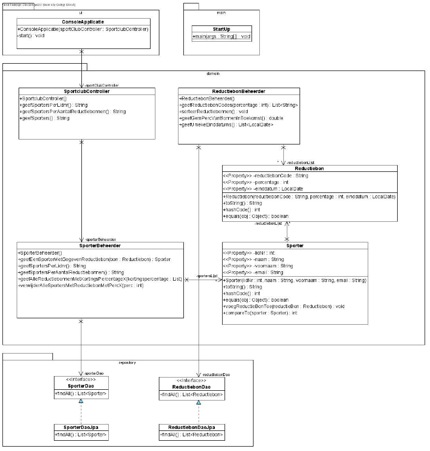
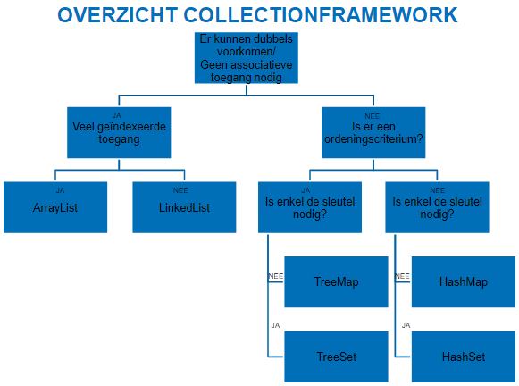
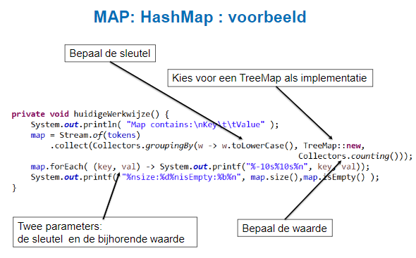
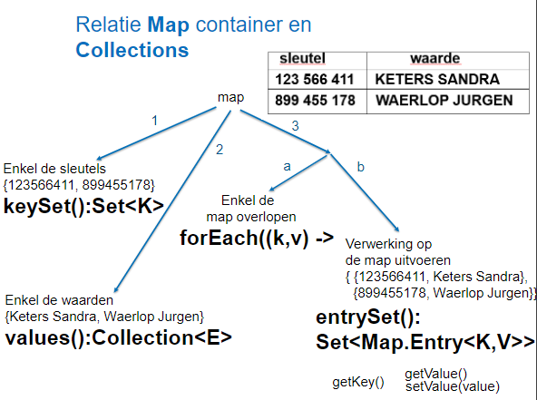
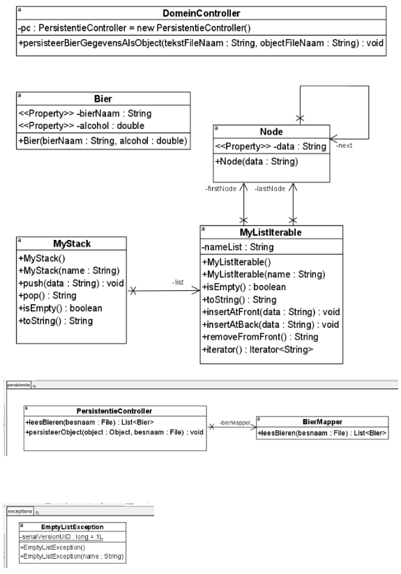
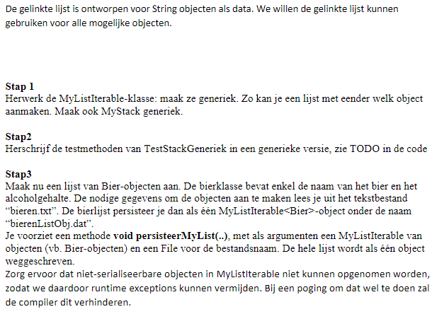
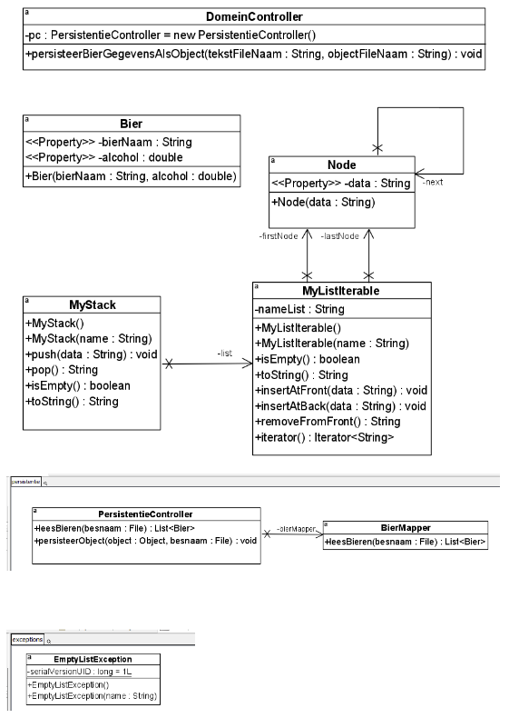
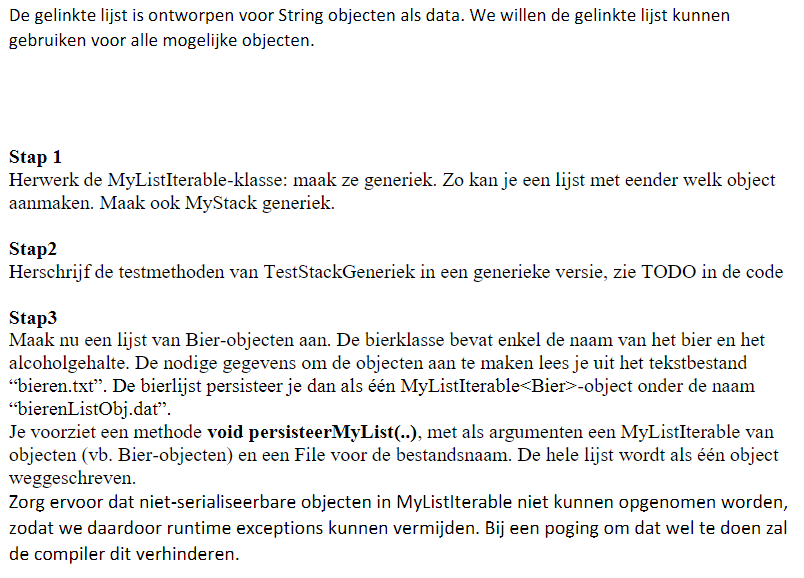

# JAVA 

# Collections & streams

## Reductiebonnen



### Reductiebonbeheerder
Gemakzuchtige statische fabrieksmethoden op de List, Set en Map interfaces laten je eenvoudig niet wijzigbare lijsten, sets en maps maken. Een verzameling wordt als niet wijzigbaar beschouwd als elementen niet kunnen worden toegevoegd, verwijderd of vervangen.  
Omzetten naar een niet-wijzigbare lijst
```java
public List<Reductiebon> getReductiebonLijst() {
	//return reductiebonLijst;
	return Collections.unmodifiableList(reductiebonLijst);
}
```

#### Vraag 1:
Methode geefReductiebonCodes: een lijst van reductiebonCodes wordt teruggegeven waarvan de percentage hoger ligt dan het meegegeven percentage.
````java
public List<String> geefReductiebonCodes(int percentage) {
    return reductiebonLijst.stream()
        .filter(bon -> bon.getPercentage() > percentage)
        .map(Reductiebon::getReductiebonCode)
        .collect(Collectors.toList());
}
````

#### Vraag 2:
Methode sorteerReductiebonnen: sorteer de lijst met reductiebonnen volgens oplopende percentage (van laag naar hoog), en bij gelijke percentage op reductiebonCode – alfabetisch omgekeerde volgorde. (De originele lijst van reductiebonnen is gewijzigd.)
```java
public void sorteerReductiebonnen() {
		reductiebonLijst.sort(Comparator.comparing(Reductiebon::getPercentage)
				.thenComparing(Comparator.comparing(Reductiebon::getReductiebonCode)
				.reversed()));
}
```
Als er gevraagd werd, maak een nieuwe gesorteerde lijst dan moet er .stream().sorted() staan.

#### Vraag 3:
Methode geefGemPercVanBonnenInToekomst: geef het gemiddelde percentage terug van alle reductiebonnen die in de toekomst liggen (ter info: huidige datum: LocalDate.now() ).
```java
public double geefGemPercVanBonnenInToekomst() {
	return reductiebonLijst.stream() //Stream van reductiebonnen
				.filter(bon -> bon.getEinddatum().isAfter(LocalDate.now()))
				.mapToDouble(Reductiebon::getPercentage)
				.average().getAsDouble();
}
```

#### Vraag 4:
Methode geefUniekeEinddatums: geef alle unieke einddatums terug (m.a.w. geen dubbels), gesorteerd in stijgende volgorde.
```java
public List<LocalDate> geefUniekeEinddatums() {
	return reductiebonLijst.stream()
			.map(Reductiebon::getEinddatum)
			.sorted().distinct()
			.collect(Collectors.toList());
}
```

### Sporterbeheerder
```java

#### Vraag 5:
Bekijk deze klasse en pas aan. Er is nog een encapsulatie lek.
```java
public Collection<Sporter> getSportersLijst() {
	return Collections.unmodifiableCollection(sportersLijst);
}
```

#### Vraag 6:
Methode geefEenSporterMetGegevenReductiebon: geeft een willekeurige sporter terug die de gegeven reductiebon bevat. Indien geen sporter aanwezig, dan wordt null teruggegeven.
```java
public Sporter geefEenSporterMetGegevenReductiebon(Reductiebon bon) {
	return sportersLijst.stream()
			.filter(sporter -> sporter.getReductiebonLijst().contains(bon)) //Stream<Sporters>
			.findAny() //Optional<Sporter>
			.orElse(null); 
}
```

#### Extra vraag 1
Methode geefAlleReductiebonnenMetKortingsPercentageX: geeft een lijst van alle Reductiebonnen met die één van de meegegeven kortingspercentages hebben.
```java
public List<Reductiebon> geefAlleReductiebonnenMetKortingsPercentageX(List<Integer> kortingspercentage) {
	return sportersLijst.stream()
			.map(Sporter::getReductiebonLijst)
			.flatMap(Collection::stream)
			.filter(bon -> kortingspercentage.contains(bon.getPercentage()))
			.collect(Collectors.toList());
}
```

#### Extra vraag 2
Methode verwijderAlleSportersMetReductiebonMetPercX : zal alle sporters uit de originele lijst verwijderen die als korting het meegegeven percentage hebben.
Opgelet: Testmethode uncomment
```java
public void verwijderAlleSportersMetReductiebonMetPercX(int perc) {
	sportersLijst.removeIf(sporter -> sporter.getReductiebonLijst().stream()
			.anyMatch(bon -> bon.getPercentage()== perc));	
}
```

## MAP

HashMap<K,V> en Hashtable<K,V> zijn implentatie-klassen van Map.  
TreeMap<K,V> is een implementatie-klasse van SortedMap.  
De klasse properties is een subklasse van HashTable<K,V>  

**Implementaties van interface Map<K,V>:**
- HashMap<K,V>
  - Elementen opgeslagen in een hash-tabel
- Hashtable<K,V>
  - Zoals HashMap maar verouderde versie.
  - Werpt een NullPointerException indien de sleutel of value null is. 
- TreeMap<K,V>
  - Gesorteerd
  - Elementen opgeslagen in boomstructuur
  - Implementatie van SortedMap subinterface van Map. Gebruik de natuurlijke volgorde of een comparator. 




### Java_Map_Oefeningen_start
```Java
class Auteur {

    private String naam, voornaam;

    public Auteur(String naam, String voornaam) {
        setNaam(naam);
        setVoornaam(voornaam);
    }

    public String getNaam() {
        return naam;
    }

    public String getVoornaam() {
        return voornaam;
    }

    public void setNaam(String naam) {
        this.naam = naam;
    }

    public void setVoornaam(String voornaam) {
        this.voornaam = voornaam;
    }

    @Override
    public String toString() {
        return String.format("%s %s", naam, voornaam);
    }
}

public class OefMap_opgave {
    public OefMap_opgave() {
        // we zullen een hashmap gebruiken waarbij auteursid de sleutel is en
        // de waarde is naam en voornaam van Auteur.
        //Creëer de lege hashMap "auteursMap"; de sleutel is van type Integer, de waarde van type Auteur
        //----------------------------------------------------------------------------------
        Map<Integer, Auteur> auteursMap = new HashMap<>();
        
        //Voeg toe aan de hashmap: auteursID = 9876, naam = Gosling, voornaam = James
        //Voeg toe aan de hashmap: auteursID = 5648, naam = Chapman, voornaam = Steve
        //-------------------------------------------------------------------------------
        auteursMap.put(9876, new Auteur("Gosling", "James"));
        auteursMap.put(5648, new Auteur("Chapman", "Steve"));
        
        //Wijzig de voornaam van Chapman: John ipv Steve
        //----------------------------------------------
        auteursMap.get(5648).setVoornaam("John");
        
        //Komt de auteursID 1234 voor in de hashmap
        //-----------------------------------------
        if (auteursMap.containsKey(1234))
		System.out.println("auteursID 1234 komt voor\n");
        else
		System.out.println("auteursID 1234 komt niet voor\n");
         
        //Toon de naam en voornaam van auteursID 5648
        //-------------------------------------------
        
		Auteur auteur = auteursMap.get(5648);
		if (auteur != null)
			System.out.println(auteur);
         
        toonAlleAuteurs(auteursMap);

        //Alle auteursID's worden in stijgende volgorde weergegeven.
        //  1) de hashMap kopiëren naar een treeMap (= 1 instructie)
        //  2) roep de methode toonAlleSleutels op.
        //---------------------------------------------------------------
        Map<Integer, Auteur> treeMap = new TreeMap<>();
        toonAlleAuteurs(auteursMap);
        
    }

    public void toonAlleSleutels(Map<Integer, Auteur> map) {
        //Alle sleutels van de map worden op het scherm weergegeven.
        //---------------------------------------------------------------
    	map.keySet().forEach(System.out::println);
        System.out.println();
    }

    public void toonAlleAuteurs(Map<Integer, Auteur> map) {
        /*Alle gegevens van de map worden op het scherm weergegeven.
		Per lijn wordt een auteursnr, naam en voornaam weergegeven.*/
        //---------------------------------------------------------------
    	//NIET ZO -> OVERKILL
    	//map.entrySet().stream().forEach(entry -> System.out.printf("%d %s%n", entry.getKey(), entry.getValue()));
        map.forEach((auteursId, auteur) -> System.out.printf("%d %s%n",auteursId, auteur));
    	System.out.println();
    }

    public static void main(String args[]) {
        new OefMap_opgave();
    }
}
```
```Java
class CollectionOperaties {
    
    //methode verwijderOpLetter
    //-------------------------
	public static boolean verwijderOpLetter(List<String> list, char c) {
		return list.removeIf(elem -> elem.charAt(0)==c);
	}

    //methode verwijderSequence
    //-------------------------
	public static boolean verwijderSequence(List<String> list, String grens) {
		int first = list.indexOf(grens);
		if (first==-1) {
			return false;
		}
		int last = list.lastIndexOf(grens);
		list.subList(first, last).clear();
		return true;
		
	}

	//uitbreiding opgave Fruit   addOrdered
	//-------------------------------------
	public static boolean addOrdered(List<String> list, String fruit) {
		int index = Collections.binarySearch(list, fruit);
		if(index>=0) {
			return false;
		}
		list.add(index*-1,fruit);
		return true;
	}
}

public class OefFruit_opgave {

    public static void main(String args[]) {
        String kist[][] = {{"appel", "peer", "citroen", "kiwi", "perzik"},
        {"banaan", "mango", "citroen", "kiwi", "zespri", "pruim"},
        {"peche", "lichi", "kriek", "kers", "papaya"}};

        List<String> list = Stream.of(kist).flatMap(Arrays::stream).collect(Collectors.toList());
        String mand[];

        //Toon de inhoud van de array "kist"
        //----------------------------------
        System.out.println(Arrays.deepToString(kist));
        //Arrays.toString werkt voor 1 dim array
        
        
        //Voeg de verschillende kisten samen in een ArrayList list.
        //--------------------------------------------------------


        CollectionOperaties.verwijderOpLetter(list, 'p');
        System.out.println("na verwijder letter ('p') :  " + list + "\n");

        CollectionOperaties.verwijderSequence(list, "kiwi");
        System.out.println("na verwijder sequence (kiwi) : " + list + "\n");
        
        //UITBREIDING
        list.sort(null);
        CollectionOperaties.addOrdered(list, "sapodilla");

        //Plaats het resultaat terug in een array mand en sorteer die oplopend.
        //---------------------------------------------------------------------
        mand = list.toArray(new String[0]);
        Arrays.sort(mand);

        //Toon de inhoud van de array "mand"
        //----------------------------------
        System.out.println(Arrays.toString(mand));
    }
}
```
```Java
public class OefFruitMap_opgave {

    public static void main(String args[]) {
        String kist[][] = {{"appel", "peer", "citroen", "kiwi", "perzik"},
        {"banaan", "mango", "citroen", "kiwi", "zespri", "pruim"},
        {"peche", "lichi", "kriek", "kers", "papaya"}};

        List<String> list = Stream.of(kist).flatMap(Arrays::stream).collect(Collectors.toList());
        Scanner in = new Scanner(System.in);

        //declaratie + creatie map
        //------------------------------
        Map<String, Double> fruitMap = new TreeMap<>();
                            
        /*Berg de fruit list van vorige oefeningen in een boom
        op zodat dubbels ge�limineerd worden.
        Er moet ook de mogelijkheid zijn de bijhorende prijs
        (decimale waarde) bij te houden.*/
        //------------------------------------------------------------
        list.forEach(fruit -> fruitMap.put(fruit, null));
        
        /*Doorloop de boom in lexicaal oplopende volgorde en vraag
        telkens de bijhorende prijs, die je mee in de boom opbergt.*/
        //------------------------------------------------------------
        //fruitMap.forEach(...);
        fruitMap.entrySet().stream().forEach(entry -> {
        	System.out.printf("Prijs van %s : ", entry.getKey());
        	double prijs = in.nextDouble();
        	entry.setValue(prijs);
        });
        
        
        /*Druk vervolgens de volledige lijst in twee
        kolommen (naam : prijs) in lexicaal oplopende volgorde af
        op het scherm.*/
        //------------------------------------------------------------
        fruitMap.forEach((fruit, prijs) -> System.out.printf("%s\t%.2f%n", fruit, prijs));       
    }
}
```

### Java_Oefeningen2_start
#### Opgave


#### Code
```java 
public class BierWinkel {

    private final List<Bier> bieren;
    private PersistentieController pc = new PersistentieController();

    public BierWinkel() {
        bieren = pc.inlezenBieren("bieren.txt");
    }
    
    //OEF
    public Map<String, Bier> opzettenOverzichtBierPerNaam() {
    	return bieren.stream().collect(Collectors.toMap(Bier::getNaam, Function.identity()));
    }
    
    //OEF
    public Map<String, List<Bier>> opzettenOverzichtBierenPerSoort() {
    	//return bieren.stream().collect(Collectors.groupingBy(Bier::getSoort));
    	return bieren.stream().collect(Collectors.groupingBy(Bier::getSoort, TreeMap::new, Collectors.toList()));
    }

    //OEF
    public Map<String, Long> opzettenAantalBierenPerSoort() {
    	return bieren.stream().collect(Collectors.groupingBy(Bier::getSoort, TreeMap::new, Collectors.counting()));
    }
}
```
```java 
public class DomeinController {

	private final BierWinkel bierWinkel;

	public DomeinController() {
		bierWinkel = new BierWinkel();
	}

	public String opzettenBierPerNaam() {
		/*
		 * return bierWinkel.opzettenOverzichtBierPerNaam().entrySet().stream()
		 * .map(entry -> String.format("%s = %s", entry.getKey(), entry.getValue()))
		 * .collect(Collectors.joining("\n"));
		 */
		return overzichtToString(bierWinkel.opzettenOverzichtBierenPerSoort());
	}

	public String opzettenAantalBierenPerSoort() {
		/*
		 * return bierWinkel.opzettenAantalBierenPerSoort().entrySet().stream()
		 * .map(entry -> String.format("%s = %s", entry.getKey(), entry.getValue()))
		 * .collect(Collectors.joining("\n"));
		 */
		return overzichtToString(bierWinkel.opzettenAantalBierenPerSoort());
	}

	public String opzettenOverzichtBierenPerSoort() {
		/*
		 * return bierWinkel.opzettenOverzichtBierenPerSoort().entrySet().stream()
		 * .map(entry -> String.format("%s = %s", entry.getKey(), entry.getValue()))
		 * .collect(Collectors.joining("\n"));
		 */
		return overzichtToString(bierWinkel.opzettenOverzichtBierenPerSoort());
	}

	// TODO na hoofdstuk generics
	// --> generieke oplossing "overzichtToString" methode
	//
	private <K, V> String overzichtToString(Map<K, V> map) {
		return map.entrySet().stream().map(entry -> String.format("%s = %s", entry.getKey(), entry.getValue()))
				.collect(Collectors.joining("\n"));
	}

}
```

## Generics
  - Alle generieke methoden hebben een **"type paramter section"**, dat tussen < en > staat.  
  - Elke **"type paramter section"** bevat één of meer **"(formal) type parameters"**, gescheiden door komma's
  - Een **"type parameter"** kan enkel referenties bevatten, geen primitieve datatypes!
```java 
public static < E >void printArray( E[]inputArray){
    Stream.of(inputArray).forEach(
      element -> System.out.printf("%s ", element));System.out.println();
}
```
- De generieke methode 'printArray' heeft als **"type parameter section"** <E>
- ...

### Oefeningen
#### Generieke methoden
```java
public class Generieke_methoden_opgave {

    public static void main(String args[]) {
        new Generieke_methoden_opgave();
    }

    public Generieke_methoden_opgave() {
        Double[] decGetallen = {3.0, 7.8, 9.0, 10.6};
        List<Double> doubleLijst = new ArrayList<>(Arrays.asList(decGetallen));

        Integer[] integer = {5, 8, 9, -6, 0, 7};
        List<Integer> integerLijst = new ArrayList<>(Arrays.asList(integer));

        String[] woorden = {"aaa", "bbb", "ccc", "ddd", "eee", "fff", "ggg", "hhh", "a"};
        List<String> stringLijst = new ArrayList<>(Arrays.asList(woorden));

//methode minimum oproepen
        Integer minGetal1 = minimum(integerLijst);
        Double minGetal2 = minimum(doubleLijst);

        System.out.printf("%s%d\n\n", "oplossing is -6, jouw oplossing = ", minGetal1);
        System.out.printf("%s%.1f\n\n", "oplossing is 3.0, jouw oplossing = ", minGetal2);

//methode geefAlleElementenKleinerDan oproepen
        List<Integer> lijstInteger = geefAlleElementenKleinerDan(integerLijst, 8);
        List<String> lijstString = geefAlleElementenKleinerDan(stringLijst, "ddd");

        weergevenLijst("oplossing : 5 -6 0 7", lijstInteger);
        weergevenLijst("oplossing : aaa bbb ccc a", lijstString);

    }

    public <E> void weergevenLijst(String oplossing, Collection<E> lijst) {

        System.out.printf("%s\n%s", oplossing, "            ");
        lijst.forEach(element -> System.out.printf("%s ", element));
        System.out.println("\n");
    }

    //------------------------------------------------------------------------
    //Schrijf de generieke methode "minimum" die het kleinste getal van een Collection
    //van type E teruggeeft.
    //------------------------------------------------------------------------
    public <E extends Comparable<E>> E minimum(Collection<E> lijst) {
    	return lijst.stream().min(E::compareTo).get();
    }
    
    
    //-------------------------------------------------------------------------------------
    //Schrijf de generieke methode geefAlleElementenKleinerDan
    //De methode heeft twee argumenten: een Collection van type E "lijst" en een element van type E "grens"
    //De methode geeft een List van type E terug; alle elementen van "lijst" die kleiner
    //zijn dan "grens" worden in de lijst bewaard.
    //-------------------------------------------------------------------------------------
    public <E extends Comparable<E>> List<E> geefAlleElementenKleinerDan(Collection<E> lijst, E grens){
    	return lijst.stream().filter(element -> element.compareTo(grens)<0).collect(Collectors.toList());
    }
}
```
#### Generieke klasse
```java 
//Gegeven:

abstract class Dier {
}

interface Huisdier {
}

class Hond extends Dier implements Huisdier {
}

class Kat extends Dier implements Huisdier {
}

class Leeuw extends Dier {
}

//Gevraagd:
//schrijf een klasse die een set van Kat, Hond of Huisdier kan bevatten
class VerzamelingHuisdier<E extends Huisdier>
{
	//attribuut "huisdieren" = set van Kat, Hond of Huisdier
	//--------------------------------------------------------------------------
	private Set<E> huisdieren = new HashSet<>();
	
    //getHuisdieren
	//-------------------
	public Set<E> getHuisdieren(){
		return Collections.unmodifiableSet(huisdieren);
	}

    //methode add: een dier toevoegen in de set
	//------------------------------------------------------------
	public void add(E dier) {
		huisdieren.add(dier);
	}
}

class Tools {
	//methode bevatHuisdier met twee argumenten: een huisdier en een set van Kat, Hond of Huisdier.
	//Geeft true terug indien het huisdier in de set voorkomt, anders false.
	//schrijf de static methode bevatHuisdier d.m.v. wildcards
	//---------------------------------------------------------------------------------------
	public static boolean bevatHuisdier(Huisdier huisdier, Set<? extends Huisdier> setHuisdieren) {
		return setHuisdieren.contains(huisdier);
	}
	
	//schrijf de static methode bevatHuisdier2 d.m.v. generieke methode
	//---------------------------------------------------------------------------------------
	public static <T extends Huisdier> boolean bevatHuisdier2(T huisdier, Set<? extends Huisdier> setHuisdieren ) {
		return setHuisdieren.contains(huisdier);
	}
	
	//schrijf de static methode geefAantal. 1 argument: Een set van Kat, Dier, Huisdier of Object.	
	//Aantal elementen van de set wordt teruggegeven.
	//---------------------------------------------------------------------------------------	
	public static int geefAantal(Set<? super Kat> dier) {
		return dier.size();
	}
}

public class Generieke_klasse_opgave {

    public static void main(String args[]) {
        Kat kat = new Kat();
        Hond hond = new Hond();
        Huisdier huisdier = new Hond();

        VerzamelingHuisdier<Kat> katten = new VerzamelingHuisdier<>();
        katten.add(kat);
        VerzamelingHuisdier<Hond> honden = new VerzamelingHuisdier<>();

        VerzamelingHuisdier<Huisdier> huisdieren = new VerzamelingHuisdier<>();
        huisdieren.add(huisdier);

        boolean komtVoor = Tools.bevatHuisdier(kat, katten.getHuisdieren());
        System.out.printf("correct = true;  %s%n", komtVoor);
        komtVoor = Tools.bevatHuisdier(hond, honden.getHuisdieren());
        System.out.printf("correct = false;  %s%n", komtVoor);
        komtVoor = Tools.bevatHuisdier(huisdier, huisdieren.getHuisdieren());
        System.out.printf("correct = true;  %s%n", komtVoor);
        //compileerfout: komtVoor = Tools.bevatHuisdier(kat, new HashSet<Dier>());

        komtVoor = Tools.bevatHuisdier2(kat, katten.getHuisdieren());
        System.out.printf("correct = true;  %s%n", komtVoor);
        komtVoor = Tools.bevatHuisdier2(hond, honden.getHuisdieren());
        System.out.printf("correct = false;  %s%n", komtVoor);
        komtVoor = Tools.bevatHuisdier2(huisdier, huisdieren.getHuisdieren());
        System.out.printf("correct = true;  %s%n", komtVoor);
        
        int aantalKatten = Tools.geefAantal(katten.getHuisdieren());
        int aantalHuisdieren = Tools.geefAantal(huisdieren.getHuisdieren());
       //compileerfout: int aantalHonden = Tools.geefAantal(honden.getHuisdieren());
        
        Set<Dier> dieren = Set.of(new Leeuw(), new Hond());
        int aantalDieren = Tools.geefAantal(dieren);
        
        int aantalObjecten = Tools.geefAantal(new HashSet<Object>());
        
        System.out.printf("correct = 1;  %d%ncorrect = 1;  %d%ncorrect = 2;  %d%ncorrect = 0;  %d%n", aantalKatten, 
        		aantalHuisdieren, aantalDieren, aantalObjecten);
     }

}
```
### Oefeningen 2


Implements Serializable plaatsen
```java 
public class Bier implements Serializable{

    private String bierNaam;
    private double alcohol;

    public Bier(String bierNaam, double alcohol) {
        this.bierNaam = bierNaam;
        this.alcohol = alcohol;
    }

    public String getBierNaam() {
        return bierNaam;
    }

    public void setBierNaam(String bierNaam) {
        this.bierNaam = bierNaam;
    }

    public double getAlcohol() {
        return alcohol;
    }

    public void setAlcohol(double alcohol) {
        this.alcohol = alcohol;
    }
}
```
```java
public class Node<T extends Serializable> implements Serializable{

    private final T data;
    private Node<T> next;

    public Node(T data) {
        this.data = data;
    }

    public T getData() {
        return data;
    }

    public void setNext(Node<T> next) {
        this.next = next;
    }

    public Node<T> getNext() {
        return next;
    }
}
```
```java 
public class MyListIterable<T extends Serializable> implements Iterable<T>, Serializable {
    
    private Node<T> firstNode;
    private Node<T> lastNode;
    private String nameList;

    public MyListIterable() {
        this("List");
    }

    public MyListIterable (String name) {
        nameList = name;
    }

    public boolean isEmpty() {
        return firstNode == null;
    }

    @Override
    public String toString() {
        if (isEmpty()) {
            return nameList + " is empty";
        }

        StringBuilder buffer = new StringBuilder();
        buffer.append("The ").append(nameList).append(" is: ");

        this.forEach(elem -> buffer.append(elem).append(" "));
        return buffer.toString();
    }

    public void insertAtFront(T data) {
        Node<T> aNode = new Node<>(data);
        if (isEmpty()) {
            firstNode = lastNode = aNode;
        } else {
            aNode.setNext(firstNode);
            firstNode = aNode;
        }
    }

    public void insertAtBack(T data) {
        Node<T> aNode = new Node<>(data);
        if (isEmpty()) {
            firstNode = lastNode = aNode;
        } else {
            lastNode.setNext(aNode);
            lastNode = lastNode.getNext();
        }
    }

    public T removeFromFront() throws EmptyListException {
        if (isEmpty()) {
            throw new EmptyListException(nameList);
        }

        T removedItem = firstNode.getData();
        if (firstNode == lastNode) {
            firstNode = lastNode = null;
        } else {
            firstNode = firstNode.getNext();
        }

        return removedItem;
    }

    @Override
    public Iterator<T> iterator() {
        return new MyIterator();
    }
   
    private class MyIterator implements Iterator<T> {
        
        private Node<T> nextToFetch = firstNode;

        @Override
        public boolean hasNext() {
        	return nextToFetch != null;
        }

        @Override
        public T next() {
            T data = nextToFetch.getData();
            nextToFetch = nextToFetch.getNext();
            return data; 
        }
    }
}
```
```java
public class MyStack<T extends Serializable> implements Serializable {

    /**
	 * 
	 */
	private static final long serialVersionUID = 1L; //Wordt automatisch gegeneerd
	private MyListIterable<T> list;

    public MyStack() {
        this("Stack");
    }

    public MyStack(String name) {
        list = new MyListIterable<>(name);
    }

    public void push(T data) {
        list.insertAtFront(data);
    }

    public T pop() {
        return list.removeFromFront();
    }

    public boolean isEmpty() {
        return list.isEmpty();
    }

    @Override
    public String toString() {
        return list.toString();
    }

}
```
```java
public class TestStackGeneriek {

	private MyStack<String> woordenStack;
	private MyStack<Double> decGetallenStack;

	@BeforeEach
	public void before() {
		woordenStack = new MyStack<>("woordenStack");
		decGetallenStack = new MyStack<>("decimaleGetallenStack");
	}

	...
	
	@Test
	public void toevoegenVerwijderenTesten() {
		String[] woorden = {"lekker", "zijn", "wafels"};
		Double[] decGetallen = {12.5, 24.3, 30.5, 40.5};
		itemsToevoegenVerwijderen(woordenStack, woorden);
		itemsToevoegenVerwijderen(decGetallenStack, decGetallen);
	}

	//public void itemsToevoegenVerwijderen(MyStack myStack,     items){

	//----------------------------------------------------------------------------
	public <E extends Serializable> void itemsToevoegenVerwijderen(MyStack<E> myStack, E[] items) {
		Stream.of(items).forEach(myStack::push);
		
		List<E> listExpected = Arrays.asList(items);
		Collections.reverse(listExpected);
		
		listExpected.stream().limit(listExpected.size()-1).forEach(expected -> {
			Assertions.assertEquals(expected, myStack.pop());
			Assertions.assertFalse(myStack.isEmpty());
		});
		
		Assertions.assertEquals(listExpected.get(listExpected.size() -1), myStack.pop());
		Assertions.assertTrue(myStack.isEmpty());
	}
	
	...

```
```java 
public class PersistentieController {

   private BierMapper bierMapper;

    public List<Bier> leesBieren(File besnaam) {
        if (bierMapper == null) {
            bierMapper = new BierMapper();
        }
        return bierMapper.leesBieren(besnaam);
    }
     
    //TODO stap 3, maak de methode generiek
    public <T extends Serializable> void persisteerObject(T object, File besnaam) {
        try (ObjectOutputStream out = new ObjectOutputStream(Files.newOutputStream(besnaam.toPath()))) {
            out.writeObject(object);
        } catch (IOException ex) {
            Logger.getLogger(BierMapper.class.getName()).log(Level.SEVERE, null, ex);
        }
    }
}
```
```java
public class DomeinController {
    
    private PersistentieController pc = new PersistentieController();
    
    public void persisteerBierGegevensAlsObject(String tekstFileNaam, String objectFileNaam){    
    	//TODO zie stap3
        List<Bier> lijstBier = pc.leesBieren(new File(tekstFileNaam));
        MyListIterable<Bier> myList = new MyListIterable<>();
        lijstBier.forEach(myList::insertAtBack);
        pc.persisteerObject(myList, new File(objectFileNaam));
    }
    
}
```

## Netwerken
#### Versturen van string (client)
```java 
private Socket socket;
private Scanner sockInput;
private Formatter sockOutput;

    public FileTransfer(String host) {
        try {
            //Maak verbinding met server, init attributen
            //TODO
        	socket = new Socket(host, 44444);
        	sockInput = new Scanner(socket.getInputStream());
        	sockOutput = new Formatter(socket.getOutputStream());
        } catch (IOException ex) {
            System.out.println("Probleem " + ex.getMessage());
        }
    }
```

#### Ontvangen van string (server)
```java 
private Socket socket;
private Scanner sockInput;
private Formatter sockOuput;
	
    public void run() {
        //initialiseer server
        //TODO
        try (ServerSocket ss = new ServerSocket(44444, 10)) {
            System.out.println("Fileserver up");
            while (true) {
                try {
                    System.out.println("Fileserver waiting...");
                    socket = ss.accept();
                    processClient();
                } catch (IOException ex) {
                    System.out.println("Problemen : " + ex.getMessage());
                } 
            }
        } catch (IOException ex) {
            System.out.println("Problemen met server connectie : " + 
                                                ex.getMessage());
        } 
    }
```
### Oefening
#### Client
```java 
public class FileTransfer {
    //Attributen netwerkverbinding/streams
    //TODO
	private Socket socket;
	private Scanner sockInput;
	private Formatter sockOutput;

    public FileTransfer(String host) {
        try {
            //Maak verbinding met server, init attributen
            //TODO
        	socket = new Socket(host, 44444);
        	sockInput = new Scanner(socket.getInputStream());
        	sockOutput = new Formatter(socket.getOutputStream());
        } catch (IOException ex) {
            System.out.println("Probleem " + ex.getMessage());
        }
    }

    public String readFile(String fileNaam) {
        //verzoek server om bestand  'fileNaam' door te sturen
        //lees het bestand in als de server het doorstuurt
        //TODO
        sockOutput.format("%s%n", "READ");
        sockOutput.format("%s%n", fileNaam);
        sockOutput.flush();
        String reactie = sockInput.nextLine();
        if(reactie.equals("FOUND")) {
        	String line;
        	StringBuilder fileContent = new StringBuilder();
        	while(!(line = sockInput.nextLine()).equals("*E*O*F*")) {
        		//verwerking
        		fileContent.append(line).append(System.lineSeparator());
        	}
        	return fileContent.toString();
        }
            
        return "BESTAND NIET GEVONDEN";
    }

    public void updateFile(String fileContents, String fileNaam) {
        //meld de server dat je het gewijzigde bestand gaat doorsturen
        //geef de eventueel gewijzigde bestandsnaam mee door
        //bij onveranderde bestandsnaam zal de server het originele bestand overschrijven
        //stuur het bestand door naar de server
        //TODO
    	sockOutput.format("%s%n", "REWRITE");
        sockOutput.format("%s%n", fileNaam);
        sockOutput.flush();
        sockOutput.format(fixEOL(fileContents));
        sockOutput.format("%s%n", "*E*O*F*");
    	sockOutput.flush();
    }
    
    public void closeConnection() {
        try {
        //TODO
        socket.close();
        } catch (IOException ex) {
            System.out.println("Probleem " + ex.getMessage());
        }
    }
    
    //De laatste regel moet eindigen met de systeem einde regel. 
    //Enkel \n of \r is niet goed.
    public String fixEOL(String text) {
        if (!text.endsWith(System.lineSeparator())) {
            int count = 0;
            int lastChar = text.length() - 1;
            if (lastChar >= 0 && (text.charAt(lastChar) == '\n' || 
                    text.charAt(lastChar) == '\r')) {
                count++;
            }
            if (lastChar > 0 && (text.charAt(lastChar - 1) == '\r')) {
                count++;
            }
            if (count > 0) {
                text = text.substring(0, text.length() - count);
            }
            return text + System.lineSeparator();
        }
        return text;
    }
}
```
#### Server
```java 
public class FileServer {
    //attributen voor netwerkconnectie en streams
	//TODO
	private Socket socket;
	private Scanner sockInput;
	private Formatter sockOutput;

    public void run() {
        //initialiseer server
        //TODO
        try (ServerSocket ss = new ServerSocket(44444, 10)) {
            System.out.println("Fileserver up");
            //wacht tot een client verbindig maakt
            //verwerk al de verzoeken van een client tot deze afsluit
            //          delegeer naar hulpmethode processClient
            //wacht opnieuw op een client, blijft dit doen
            //TODO
            while (true) {
                try {
                    System.out.println("Fileserver waiting...");
                    socket = ss.accept();
                    processClient();
                } catch (IOException ex) {
                    System.out.println("Problemen : " + ex.getMessage());
                } 
            }
        } catch (IOException ex) {
            System.out.println("Problemen met server connectie : " + 
                                                ex.getMessage());
        } 
    }

    private void processClient() {
        //verwerk al de verzoeken van een client volgens het afgesproken protocol 
        //tot deze afsluit
        //sluit dan ook de connectie met deze client
        //maak gebruik van de 3 onderstaande hulpmethoden
        try {
        	sockInput = new Scanner(socket.getInputStream());
        	sockOutput = new Formatter(socket.getOutputStream());
        	File file;
        	while(sockInput.hasNextLine()) {
        		String actie = sockInput.nextLine();
        		switch(actie) {
        			case "READ" -> {
        				file = new File(sockInput.nextLine());
        				System.out.println("READ" + file.getName());
        				if(file.exists())
        					sendFile(file);
        				else
        					sendNoFile();
        			}
        			case "REWRITE" -> {
        				file = new File(sockInput.nextLine());
        				System.out.println("REWRITE" + file.getName());
        				readAndSaveUpdateFile(file);
        			}
        		}
        	}
        } catch (IOException ex) {
            System.out.println("Problemen met client connectie : " + 
                    ex.getMessage());
        }
    }

    private void sendFile(File file) throws IOException {
        //TODO
    	sockOutput.format("%s%n", "FOUND");
    	sockOutput.flush();
    	try(Scanner diskFile = new Scanner(file)){
    		while(diskFile.hasNext()) {
    			sockOutput.format("%s%n", diskFile.nextLine());
    			sockOutput.flush();
    		}
    	}
    	sockOutput.format("%s%n", "*E*O*F*");
    	sockOutput.flush();
    }

    private void sendNoFile() {
        //TODO
    	sockOutput.format("%s%n", "NOTFOUND");
    	sockOutput.flush();
    }
    
    private void readAndSaveUpdateFile(File file) throws IOException {
        //TODO
        try(Formatter naarSchijf = new Formatter(file)){
        	String line;
        	while(!(line = sockInput.nextLine()).equals("*E*O*F*")) {
        		naarSchijf.format("%s%n", file);
        	}
        }
    }
}
```