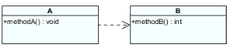
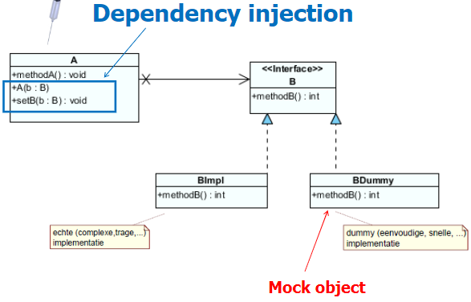
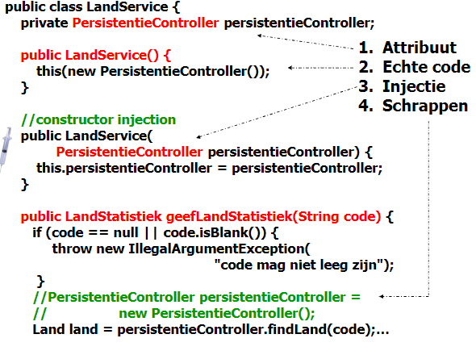
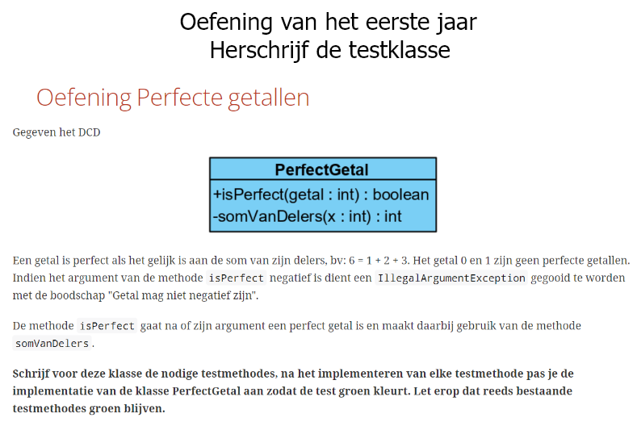
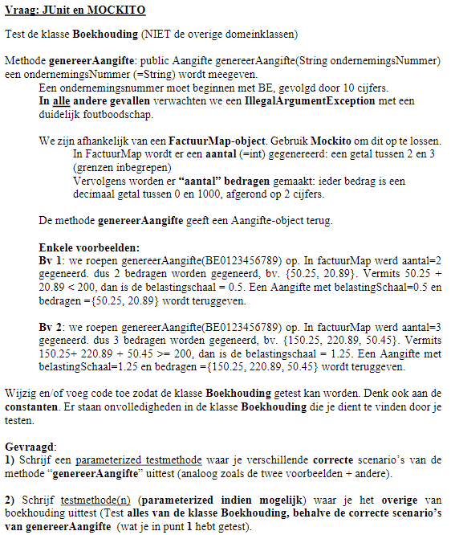
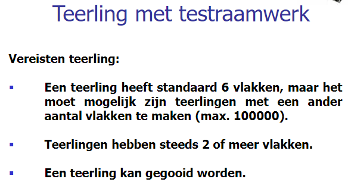
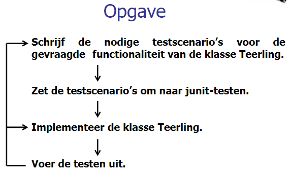

# Test Driven Development

protected = is private + subklasses toegang geven, package access

## Junit

### Verschillende soorten sources
1. **CsvSource**: Meerdere primititieve datatypes (meerdere params)
```java
@CsvSource({"0.0, 1.0, 2,0"})
```
2. **Valuesource**: Enkele primitief datatype (enkele param)
```java
@ValueSource(strings = {" ", "a", "A"})
```
3. **MethodSource**: Objecten
```java
private static Stream<Arguments> addFixture() {
    return Stream.of(
        Arguments.of(new int[]{5},5),
        Arguments.of(new int[]{2,3}, 5),
        Arguments.of(new int[]{5,6,9}, 5)
    );
}

@MethodSource("addFixture")
```

### Oefening Weegschaal

#### Opgave


Je schrijft de test voor je een klasse implementeert.

#### Code
Domeinklasse
```java
package domein;

import java.math.BigInteger;

public class Weegschaal {

	private BigInteger gewicht = BigInteger.ZERO;

	public BigInteger getGewicht() {
		return this.gewicht;
	}

	public void vermeerder(BigInteger nieuwGewicht) {
		if (nieuwGewicht == null || nieuwGewicht.signum() < 0)
			throw new IllegalArgumentException("ongeldige waarde");
		gewicht = gewicht.add(nieuwGewicht);
	}
}
```
Testklasse
```java
import org.junit.jupiter.api.Assertions;
//static wegdoen zorgt ervoor dat je assertions wel moet schrijven, 
//indien hij er wel staat moet je ze niet schrijven

class WeegschaalTest {

	private Weegschaal weegschaal;

	@BeforeEach
	public void before() { // de naam van de methode mag je zelf kiezen
		weegschaal = new Weegschaal();
	}

	@Test
	public void gewichtVermeerderen() {
		BigInteger gewicht = new BigInteger("15");
		// Weegschaal weegschaal = new Weegschaal();
		weegschaal.vermeerder(gewicht);
		Assertions.assertEquals(gewicht, weegschaal.getGewicht());
	}

	@Test
	public void nieuweWeegschaalGeeftGewichtNul() {
		// Weegschaal weegschaal = new Weegschaal();
		Assertions.assertEquals(BigInteger.ZERO, weegschaal.getGewicht());
	}

	@Test
	public void gewichtVermeerderenMetNegatieveWaarde() {
		BigInteger gewicht = new BigInteger("-20");
		Assertions.assertThrows(IllegalArgumentException.class, () -> weegschaal.vermeerder(gewicht));
	}

	@Test
	public void gewichtVermeerderenMetNull() {
		Assertions.assertThrows(IllegalArgumentException.class, () -> {
			weegschaal.vermeerder(null);
		});
	}
}
```

### Parameterized Test
Een test meerdere keren uitvoeren met verschillende paramters.  
Bv: We gaan volgende klasse testen
```java
package domain;
public class Calculator {
    public double add(double a, double b) {
        return a+b;
    }
}
```
We voorzien enkele testgevallen:  
1 + 1 = 2  
2,5 + 1 = 3,5  
3,1 + 1,1 = 4,2

```java 
import domein.Calculator;

class CalculatorTest {
    private Calculator calculator;

    @BeforeEach
    public void before() {
        calculator = new Calculator();
    }

    @ParameterizedTest
    @CsvSource({"2.0, 1.0, 1.0", "3.5, 2.5, 1.0", "4.2, 3.1, 1.1"}) //csv=comma-separated values
    public void add(double expected, double valueOne, double valueTwo) {
        Assertions.assertEquals(expected, calculator.add(valueOne, valueTwo), 0);
    }
}
```

### Oefening 1


#### Opgave:

Formaat: 3cijfers-7cijfers-2cijfers  
De rest van de deling eerste tien cijfers door 97 moet gelijk zijn aan de twee laatste cijfers.

#### Code:
Domeinklasse:
```java
package domein;

public class Rekening {
	private String rekeningnummer;

	public Rekening(String rekeningnummer) {
		setRekeningnummer(rekeningnummer);
	}

	private void setRekeningnummer(String rekeningnummer) {
		if (rekeningnummer == null || rekeningnummer.isBlank()) {
			throw new IllegalArgumentException("rekeningnummer niet ingevuld");
		}

		if (!rekeningnummer.matches("\\d{3}-\\d{7}-\\d{2}")) {
			throw new IllegalArgumentException("rekeningnummer in verkeerd formaat");
		}
		
		String[] token = rekeningnummer.split("-");
		long eerste10Cijfers = Long.parseLong(token[0] + token[1]);
		long laatste2Cijfers = Long.parseLong(token[2]);

		if (eerste10Cijfers % 97L != laatste2Cijfers)
			throw new IllegalArgumentException("verkeerde cijfers in rekeningnummer");

		this.rekeningnummer = rekeningnummer;	
	}
}
```
Testklasse:
```java
package testen;

import ...

import domein.Rekening;

class RekeningTest {
	
	@ParameterizedTest
	@ValueSource(strings = {"063-1547563-60", "999-9999999-48", "001-0000001-77"})

	public void geldRekeningnummer(String rekeningnummer) {
		Assertions.assertDoesNotThrow(()->{
			new Rekening(rekeningnummer);
		});
	}
	
	@ParameterizedTest
	@NullAndEmptySource
	@ValueSource(strings = {"063-1547563-61", " ", "063-1547563"})
	
	public void ongeldigeRekeningnummer(String rekeningnummer) {
		Assertions.assertThrows(IllegalArgumentException.class, ()->{
			new Rekening(rekeningnummer);
		});
	}
	
	
	/*@Test
	public void nummerOk() {
		Assertions.assertDoesNotThrow(()->{
			new Rekening("063-1547563-60");
		});
	}
	
	@Test
	public void grootNummerOk() {
		Assertions.assertDoesNotThrow(()-> {
			new Rekening("999-9999999-48");
		});
	}*/
}
```

### Oefening Bowling

#### Opgave

  
The game consists of 10 frames as shown above.  In each frame the player hastwo opportunities to knock down 10 pins.  The score for the frame is the totalnumber of pins knocked down, plus bonuses for strikes and spares.  
A spare is when the player knocks down all 10 pins in two tries. The bonus forthat frame is the number of pins knocked down by the next roll.  Soin frame 3above, the score is 10 (the total number knocked down) plus a bonus of 5 (thenumber of pins knocked down on the next roll.)  
A strike is when the player knocks down all 10 pins on his first try.  The bonusfor that frame is the value of the next two balls rolled.  
In the tenth frame a player who rolls a spare or strike is allowed to roll the extraballs to complete the frame.  However no more than three balls can be rolled intenth frame.

Write a class named "BowlingGame" that has two methods:
- **roll(pins : int)** is called each time the player rolls a ball.  The argument is the number of pins knocked down.
- **score() : int** is called only at the very end of the game.  It returns the total score for that game.

Create a class **BowlingGame** and test **BowlingGameTest**

#### Ontwerp:


#### Code
Domeinklasse:
```java
package domain;
public class BowlingGame {
	
	private int rolls[] = new int[21];
	private int currentRoll = 0;

	public void roll(int pins) {
		rolls[currentRoll++] = pins;
		
	}

	public int score() {
		int score = 0;
		for(int frameIndex = 0, frame = 0;frame<10; frameIndex+=2, frame++) 
			if(isStrike(frameIndex)) {
				score += 10 + strikeBonus(frameIndex);
				frameIndex--;
			}
			else if(isSpare(frameIndex))
				score += 10 + spareBonus(frameIndex);
			else
				score += sumOfPinsInFrame(frameIndex);
		return score;
	}
	
	private int sumOfPinsInFrame(int frameIndex) {
		return  rolls[frameIndex] + rolls[frameIndex+1];
	}
	
	private int strikeBonus(int frameIndex) {
		return rolls[frameIndex+1] + rolls[frameIndex+2];
	}
	
	private int spareBonus(int frameIndex) {
		return rolls[frameIndex+2];
	}
	
	private boolean isStrike(int frameIndex) {
		return rolls[frameIndex]==10;
	}

	private boolean isSpare(int frameIndex) {
		return rolls[frameIndex] + rolls[frameIndex + 1] == 10;
	}
}
```
Testklasse:
```java
package tests;

import ...

import domain.BowlingGame;

class BowlingGameTest {
	
	private BowlingGame game;
	
	@BeforeEach
	public void before() {
		game = new BowlingGame();
	}
	
	private void rollMany(int n, int pins) {
		for(int i=0;i<n;i++) game.roll(pins);
	}
	
	private void rollSpare() {
		game.roll(5);
		game.roll(5);
	}
	
	private void rollStrike() {
		game.roll(10);
	}
	
	@ParameterizedTest
	@CsvSource({"0,0","1,20"})
	public void testSameNumberOfPins(int number, int expexted) {
		rollMany(20, number);
		Assertions.assertEquals(expexted, game.score());
	}
	
	@Test
	public void testOneSpare() {
		rollSpare();
		game.roll(3);
		rollMany(17, 0);
		Assertions.assertEquals(16, game.score());
	}
	
	@Test
	public void testTwoSpare() {
		rollSpare();
		rollSpare();
		game.roll(3);
		rollMany(15, 0);
		Assertions.assertEquals(31, game.score());
	}

	@Test
	public void testOneStrike() {
		rollStrike();
		game.roll(3);
		game.roll(4);
		rollMany(16, 0);
		Assertions.assertEquals(24, game.score());
	}
	
	@Test
	public void testAllStrikes() {
		for(int i = 0; i<12; i++) rollStrike();
		Assertions.assertEquals(300, game.score());
	}
	
	@Test 
	void testAllSpares_5_5() {
		for(int i = 0; i<10; i++) rollSpare();
		game.roll(5);
		Assertions.assertEquals(150, game.score());
	}
	
	@Test
	public void testScenario() {
		int[] pins = {1,4,4,5,6,4,5,5,10,0,1,7,3,6,4,10,2,8,6};
		for(int i=0; i<pins.length;i++) game.roll(pins[i]);
		Assertions.assertEquals(133, game.score());
	}
	
}
```

## Mockito
  
Klasse A roept een methode van klasse B op. Klasse A is dependent op klasse B  
**Probleem**: Geen geisoleerde teset van klasse A  
**Oplossing**: Mock objecten

**Mock Object**: een softwareobject speciaal gemaakt om de eigenschapen en gedragingen te simuleren van een of meerdere objecten tijdens het testen. 

### Dependency injection


#### Klasse A
```java
Public class A {
    private B b;
    
    public A() {
        this(new BImpl());
    }
    
    public A(B b) {
        this. b = b;
    }
    
    public void methodeA() {
        b.methodeB();
    }
}
```
#### Klasse ATest
```java 
class ATest {
    private A e;
    
    @BeforeEach
    public void before() {
        a = new A(new BDummy());
    }
    
    @Test
    public void testMethodeA() {
        a.methodA;
    }
}
```

### Stappenplan
#### Refactor van de te testen klasse
1. Attribuut aanmaken van de dummyklasse (dependency)
```java
private Mikey mikey;
```
2. Constructor aanmaken met initialisatie
```java
public Class() {
    this(new Mikey());
}
```
3. Constructor aanmaken met injectie
```java
public Class(Mikey mikey) {
    this.mikey = mikey;
}
```
4. Schrap eerdere creatie
```java
// Mikey mikey = new Mikey();
```

#### Opzet testklasse
1. KLasse annotatie (krijg je op examen)
```java
@ExtendWith(MockitoExtension.class)
public class test {}
```
2. Mock declareren
```java
@Mock
private Mikey mikeyMock;
```
3. Mock injecteren
```java
@InjectMocks
private Class class;
```

#### Opbouw mockito test
1. Juiste source kiezen dmv te bepalen welke params er moeten meegegeven worden
2. Welke resultaten verwachten we? (meegeven met params)
3. Mock trainen
```java
Mockito.when(mikeyMock.method()).thenReturn(param);
```
4. Te testen methode uitvoeren
```java
Class class = class.method();
```
5. Params vergelijken met opgeslagen oplossing
```java
Assertions.assertEquals(param, class);
```
6. Per getrainde mock een verify
```java
Mockito.verify(mikeyMock).method();
```

#### Mockito.lenient()
**Mock trainden zonder lenient**: we krijgen een extra controle: de methode van de mock moet minstens één keer opgeroepen worden. 
**Mock trainen met lenient**: de extra controle ongedaan maken
### Voorbeeld

De testen klasse
```java
package persistentie;

import domein.Land;

public class PersistentieController {

   private LandMapper landMapper;
   private ContinentMapper continentMapper;

    public Land findLand(String code) {
        loadLandMapper();
        return landMapper.findLand(code);
    }

    public int findOppervlakteAlleLanden() {
        loadLandMapper();
        return landMapper.findOppervlakteAlleLanden();
    }

    public long findAantalBewoners(String continent) {
        loadContinentMapper();
        return continentMapper.findAantalBewoners(continent);
    }

    public long findGeboortecijfers(String continent) {
        loadContinentMapper();
        return continentMapper.findGeboortecijfers(continent);
    }

    public long findSterfteCijfer(String continent) {
        loadContinentMapper();
        return continentMapper.findSterfteCijfer(continent);
    }

    private void loadLandMapper() {
        if (landMapper == null) {
            landMapper = new LandMapper();
        }
    }

    private void loadContinentMapper() {
        if (continentMapper == null) {
            continentMapper = new ContinentMapper();
        }
    }
}
```
Testklasse
```java
@ExtendWith(MockitoExtension.class)
class LandServiceTest {

	@Mock
	private PersistentieController persistentieControllerDummy;

	@InjectMocks
	private LandService landService;

	private static final int oppervlakte = 110;

	@ParameterizedTest
	@CsvSource({ "BE, 10, 0.1", "NL, 22, 0.2", "DE, 78, 0.7" })
	public void testGeefLandStatistiekScenario(String landCode, int landOppervlakte, double verwachteResultaat) {
		Mockito.when(persistentieControllerDummy.findLand(landCode)).thenReturn(new Land(landCode, landOppervlakte));

		Mockito.when(persistentieControllerDummy.findOppervlakteAlleLanden()).thenReturn(oppervlakte);

		LandStatistiek stat = landService.geefLandStatistiek(landCode);

		Assertions.assertEquals(landCode, stat.landCode());

		Assertions.assertEquals(verwachteResultaat, stat.verhouding(), 0.01);

		Mockito.verify(persistentieControllerDummy).findLand(landCode);
		Mockito.verify(persistentieControllerDummy).findOppervlakteAlleLanden();

	}

	@ParameterizedTest
	@NullAndEmptySource
	@ValueSource(strings = { "        " })
	public void lege_spaties_nullCode(String landCode) {
		Assertions.assertThrows(IllegalArgumentException.class, () -> {
			landService.geefLandStatistiek(landCode);
		});
	}

	@Test
	public void landBestaatNiet() {
		final String CODE_GEEN_LAND = "GEEN_LAND";
		Mockito.when(persistentieControllerDummy.findLand(CODE_GEEN_LAND)).thenReturn(null);
		Mockito.lenient().when(persistentieControllerDummy.findOppervlakteAlleLanden()).thenReturn(100);

		Assertions.assertNull(landService.geefLandStatistiek(CODE_GEEN_LAND));

		Mockito.verify(persistentieControllerDummy).findLand(CODE_GEEN_LAND);

		Mockito.verify(persistentieControllerDummy,
		Mockito.times(0)).findOppervlakteAlleLanden();

	}
}
```

### Oefening 

#### Opgave


#### Oplossing
De testen klassen
```java
package domein;

import persistentie.PersistentieController;

public class ContinentService {

	private static final int PER_1000_INWONERS = 1000;
	
	private PersistentieController persistentieController; //STAP1
	
	public ContinentService () { // STAP2
		this(new PersistentieController());
	}
	
	public ContinentService(PersistentieController persistentieController) { //STAP3
		this.persistentieController = persistentieController;
	}

	public double geefGeboorteOverschot(String continent) {
		if (continent == null || continent.isBlank()) {
			throw new IllegalArgumentException("continent moet ingevuld zijn");
		}
		//PersistentieController persistentieController = new PersistentieController(); //STAP4
		long aantalInwoners = persistentieController.findAantalBewoners(continent);
		if (aantalInwoners <= 0) {
			throw new IllegalArgumentException("geen inwoners gevonden voor gegeven continent");
		}

		long aantalSterfgevallen = persistentieController.findSterfteCijfer(continent);
		long aantalGeboorten = persistentieController.findGeboortecijfers(continent);
		if(aantalSterfgevallen<0|| aantalGeboorten<0) {
			throw new IllegalArgumentException();
		}

		double geboortecijfer = (double) aantalGeboorten / aantalInwoners * PER_1000_INWONERS;
		double sterftecijfer = (double) aantalSterfgevallen / aantalInwoners * PER_1000_INWONERS;

		return geboortecijfer - sterftecijfer;
	}
}
```

Testklasse
```java
@ExtendWith(MockitoExtension.class)
class ContinentServiceTest {
	@Mock
	private PersistentieController persistentController;
	@InjectMocks
	private ContinentService continentService;
	
	private static final String CODE = "Code";
	
	@Test
	public void testGeboorteOverschot() {
		//trainen
		dummyTrainen(16405399L, 184634L, 135136L);
		//assert en controle
		controle(3.01);
	}
	
	@Test
	public void testSterfteOverschot() {
		dummyTrainen(18506500L, 277597L, 333117L);
		controle(-3);
	}
	
	private void dummyTrainen(long aantalInwoners, long aantalGeboorten, long aantalStergevallen) {
		
		Mockito.lenient().when(persistentController.findAantalBewoners(CODE)).thenReturn(aantalInwoners);
		Mockito.lenient().when(persistentController.findGeboortecijfers(CODE)).thenReturn(aantalGeboorten);
		Mockito.lenient().when(persistentController.findSterfteCijfer(CODE)).thenReturn(aantalStergevallen);
	}
	
	private void controle(double verwachteResultaat) {
		double geboorteOverschot = continentService.geefGeboorteOverschot(CODE);
		Assertions.assertEquals(verwachteResultaat, geboorteOverschot, 0.01);
		Mockito.verify(persistentController).findAantalBewoners(CODE);
		Mockito.verify(persistentController).findGeboortecijfers(CODE);
		Mockito.verify(persistentController).findSterfteCijfer(CODE);
	}
	
	//100% cover
	@ParameterizedTest
	@NullAndEmptySource
	@ValueSource(strings = " ")
	public void legeSpatieNullContinent(String continent) {
		Assertions.assertThrows(IllegalArgumentException.class, 
				() -> continentService.geefGeboorteOverschot(continent));
	}
	
	//CSVsource werkt niet met long constante vb 123L
	//dus method source
	private static Stream<Arguments> opsommingOngeldigeWaarden(){
		return Stream.of(
				Arguments.of(0L, 100L, 100L), 
				Arguments.of(-1L, 100L, 100L),
				Arguments.of(100L, -1L, 100L),
				Arguments.of(100L, 100L, -1L));
	}
	
	@ParameterizedTest
	@MethodSource("opsommingOngeldigeWaarden")
	public void ongeldigeWaarden(long aantalInwoners, long aantalGeboorten, long aantalStergevallen) {
		dummyTrainen(aantalInwoners, aantalGeboorten, aantalStergevallen);
		Assert.assertThrows(IllegalArgumentException.class, 
				() -> continentService.geefGeboorteOverschot(CODE));
	}

	private static Stream<Arguments> randWaarden(){
		return Stream.of(
				Arguments.of(1L, 15L, 14L, 1000.0), 
				Arguments.of(30000L, 0L, 15020L, -500.66),
				Arguments.of(30000L, 15020L, 0L, 500.66),
				Arguments.of(1L, 0L, 0L, 0));
	}
	@ParameterizedTest
	@MethodSource("randWaarden")
	public void geldigeWaarden(long aantalInwoners, long aantalGeboorten, long aantalStergevallen, double verwachtResultaat) {
		dummyTrainen(aantalInwoners, aantalGeboorten, aantalStergevallen);
		controle(verwachtResultaat);
	}
}
```

## Herhalingsoefeningen 

### Perfect getal

```java 
class PerfectGetalTest {

	private PerfectGetal perfectGetal;

	@BeforeEach
	public void before() {
		perfectGetal = new PerfectGetal();
	}

    //Oplossing 1 TI	
	/*@ParameterizedTest
	@ValueSource(ints = { 6, 28, 496, 8128 })
	public void isPerfect_PerfectGetal_True(int getal) {
		assertTrue(perfectGetal.isPerfect(getal));
	}

	@ParameterizedTest
	@ValueSource(ints = { 0, 1, 2, 7, 10, 9000 })
	public void isPerfect_GeenPerfectGetal_False(int getal) {
		assertFalse(perfectGetal.isPerfect(getal));
	}*/

	//Oplossing 2TI	
	//TODO
	@ParameterizedTest
	@CsvSource({"6, true", "0, false", "28, true", "496, true", "2, false"})
	public void isPerfectGetal(int getal, boolean resultaat) {
		Assertions.assertEquals(resultaat, perfectGetal.isPerfect(getal));
	}
	
	@ParameterizedTest
	@ValueSource(ints = { -1, -10, Integer.MIN_VALUE })
	public void isPerfect_OngeldigGetal_Exception(int getal) {
		assertThrows(IllegalArgumentException.class, () -> perfectGetal.isPerfect(getal));
	}
}
```

### Mockito boekhouding
(voorbeeld examenvraag)

#### Domeinklases
```java
public record Aangifte( double belastingSchaal, double[] bedragen) {}

//belastingSchaal()
//bedragen()
```
```java 
public class Boekhouding {
  
    public /*private*/ static final double BELASTINGSCHAAL_0 = 0.5;
    public /*private*/ static final double BELASTINGSCHAAL_1 = 1.25;
   
    //STAP 1
    private FactuurMap factuurMap;
    
    //STAP 2
    public Boekhouding() {
    	setFactuurMap(new FactuurMap()); //OF this(new FactuurMap());
    }
    
    //STAP 3							OF constructor injectie
    public final void setFactuurMap(FactuurMap factuurMap) {
    	this.factuurMap = factuurMap;
    }
    
    
    public Aangifte genereerAangifte(String ondernemingsNummer) {
    	//toegevoegd
    	if(ondernemingsNummer == null || ondernemingsNummer.isBlank())
    		throw new IllegalArgumentException("ondernemingsnummer verplicht in te vullen");
    	
        if (!ondernemingsNummer.matches("BE\\d{10}")) {
            throw new IllegalArgumentException("Verkeerd formaat ondernemingsnummer");
        }
        
        //STAP 4
        //FactuurMap factuurMap = new FactuurMap();

        double[] factuurOverzicht = factuurMap.geefBedragen(ondernemingsNummer);

        return new Aangifte(berekenBelastingSchaal(factuurOverzicht), factuurOverzicht);
    }

    /*Op basis van de som van alle bedragen:
    [0, 200,0[ => BELASTINGSCHAAL_0
    200,0 of hoger => BELASTINGSCHAAL_1
     */
    private double berekenBelastingSchaal(double[] factuurOverzicht) {

        double totaalBedrag = 0;
        for (double bedrag : factuurOverzicht) {
            totaalBedrag += bedrag;
        }

        if (totaalBedrag < 200.0) {
            return BELASTINGSCHAAL_0;
        }
        return BELASTINGSCHAAL_1;
    }
}
```
```java
public class FactuurMap {

    private final SecureRandom random = new SecureRandom();
    int aantal = random.nextInt(2, 4); // een getal tussen 2 en 3 wordt gegenereerd
        
    public double[] geefBedragen(String ondernemingsNummer) {
        double[] bedragen = new double[aantal];
        IntStream.range(0, aantal)
                .forEach(i -> {
                    //genereer een getal tussen 0 en 1000 [0, 1000[
                	double bedrag = random.nextDouble(1000);
                    
                    //afronden tot 2 cijfers na de komma
                    BigDecimal bd = new BigDecimal(bedrag); 
                    bd = bd.setScale(2, RoundingMode.CEILING);
                    bedrag = bd.doubleValue();
                    
                    bedragen[i] = bedrag;
                    });     
        return bedragen;
    }
}
```
#### Testklasse
```java
import static domein.Boekhouding.*;


@ExtendWith(MockitoExtension.class)
class BoekhoudingTest {

	@Mock
	private FactuurMap factuurMapMock;
	
	@InjectMocks
	private Boekhouding boekhouding;
	
	private static Stream<Arguments> opsommingGeldigeWaarden(){
		return Stream.of(
				Arguments.of(new double[] {0.0, 0.0, 0.0}, BELASTINGSCHAAL_0), //mingrens BS0
				Arguments.of(new double[] {20.0, 150.0, 29.99}, BELASTINGSCHAAL_0), //mingrens BS0 199,99
				Arguments.of(new double[] {10.78, 30.25, 29.99}, BELASTINGSCHAAL_0),
				Arguments.of(new double[] {150.0, 50.0, 0.0}, BELASTINGSCHAAL_1), //mingrens BS1
				Arguments.of(new double[] {130.22, 150.99, 99.99}, BELASTINGSCHAAL_1),
				Arguments.of(new double[] {0.0, 1000.0, 0.0}, BELASTINGSCHAAL_1),
				
				Arguments.of(new double[] {0.0, 0.0}, BELASTINGSCHAAL_0), //mingrens BS0
				Arguments.of(new double[] {170.0, 29.99}, BELASTINGSCHAAL_0), //mingrens BS0 199,99
				Arguments.of(new double[] {10.78, 29.99}, BELASTINGSCHAAL_0),
				Arguments.of(new double[] {150.0, 50.0}, BELASTINGSCHAAL_1), //mingrens BS1
				Arguments.of(new double[] {150.55, 80.88}, BELASTINGSCHAAL_1),
				Arguments.of(new double[] {0.0, 1000.0}, BELASTINGSCHAAL_1));
	}
	
	@ParameterizedTest
	@MethodSource("opsommingGeldigeWaarden")
	public void geldigeWaarden(double[] bedragen, double belastingSchaal) {
		String onderneming = "BE0123456789";
		Mockito.when(factuurMapMock.geefBedragen(onderneming)).thenReturn(bedragen);
		
		Aangifte aangifte = boekhouding.genereerAangifte(onderneming);
		Assertions.assertEquals(belastingSchaal, aangifte.belastingSchaal());
		Assertions.assertArrayEquals(bedragen, aangifte.bedragen());
		
		Mockito.verify(factuurMapMock).geefBedragen(onderneming);
	}
	
	@ParameterizedTest
	@NullAndEmptySource
	@ValueSource(strings = {"    ", "BE012345", "BE01234567890", "NL0123456789", "000123456789", "be01234567890", "BE-1234567890", "BEAZERTYUIOP", "B*0123456789"})
	public void ongeldigeWaarden(String onderneming) {
		Assertions.assertThrows(IllegalArgumentException.class, () -> {boekhouding.genereerAangifte(onderneming);});
	}
	
	@ParameterizedTest
	@ValueSource(strings = {"BE0000000000", "BE9999999999", "BE0123456789", "BE8426512736", "BE9876543210"})
	public void geldigeWaarden(String onderneming) {
		Assertions.assertDoesNotThrow(() -> {
			Mockito.when(factuurMapMock.geefBedragen(onderneming)).thenReturn(new double[] {20,50});
			boekhouding.genereerAangifte(onderneming);
		});
	}
}
```

### Teerling


```java 
public class Teerling {

    private int aantalVlakken;
    private final SecureRandom random;

    public static final int DEFAULT = 6;
    public static final int MIN_GRENS = 2;
    public static final int MAX_GRENS = 100000;
    
    public Teerling(int aantalVlakken) {
        setAantalVlakken(aantalVlakken);
        random = new SecureRandom();
    }

    public Teerling() {
        this(DEFAULT);
    }

    public int getAantalVlakken() {
        return aantalVlakken;
    }

    private void setAantalVlakken(int aantalVlakken) {

        if (aantalVlakken < MIN_GRENS || aantalVlakken > MAX_GRENS) {
            throw new IllegalArgumentException(
                    String.format("aantal vlakken moet liggen tussen %d en %d", MIN_GRENS, MAX_GRENS));
        }
        this.aantalVlakken = aantalVlakken;
    }

    public int gooi() {
        return random.nextInt(aantalVlakken) + 1;
    }
}
```

```java 
class TeerlingTest {
	
	private Teerling teerling;
	private final int AANTAL = 100;

	private void before(int grootte) {
		if (grootte == DEFAULT)
			teerling = new Teerling();
		else
			teerling = new Teerling(grootte);
	}

	private static Stream<Integer> opsommingCorrecteWaarden() {
		return Stream.of(DEFAULT, MIN_GRENS,10,20,30,50,100,1000,MAX_GRENS);
				
	}
	
	@ParameterizedTest
	//@ValueSource(ints = { DEFAULT, MIN_GRENS, 10, 15, 20, 30, 50, 100, 1000, MAX_GRENS })
	@MethodSource("opsommingCorrecteWaarden")
	public void maakTeerling_correcteGrootte_TeerlingAangemaakt(int grootte) {
		before(grootte);
		Assertions.assertEquals(grootte, teerling.getAantalVlakken());
	}

	@ParameterizedTest
	@ValueSource(ints = { Integer.MIN_VALUE, -100, -4, -1, MIN_GRENS - 1, 0, MAX_GRENS + 1 })
	public void maakTeerling_foutieveGrootte_Exception(int grootte) {

		Assertions.assertThrows(IllegalArgumentException.class, () -> {
			new Teerling(grootte);
		});
	}

//Opgelost met array
	@ParameterizedTest
	//@ValueSource(ints = { DEFAULT, MIN_GRENS, 10, 15, 20, 30, 50, 100, 1000, MAX_GRENS })
	@MethodSource("opsommingCorrecteWaarden")
	public void gooi_binnenDeGrenzen_van1TotGrootte(int grootte) {
		before(grootte);
		int[] resultaat = new int[teerling.getAantalVlakken()];
		for (int i = 0; i < teerling.getAantalVlakken() * AANTAL; i++) {
			int worp = teerling.gooi();
			Assertions.assertTrue(worp >= 1 && worp <= teerling.getAantalVlakken());
			resultaat[worp - 1]++;
		}
		Arrays.stream(resultaat).forEach(res -> Assertions.assertTrue(res > 0));
	}

//Opgelost met set	
	@ParameterizedTest
	//@ValueSource(ints = { DEFAULT, MIN_GRENS, 10, 15, 20, 30, 50, 100, 1000, MAX_GRENS })
	@MethodSource("opsommingCorrecteWaarden")
	public void gooi_binnenDeGrenzen2_van1TotGrootte(int grootte) {
		before(grootte);
		Set<Integer> resultaat = new HashSet<>();
		for (int i = 0; i < teerling.getAantalVlakken() * AANTAL; i++) {
			int worp = teerling.gooi();
			Assertions.assertTrue(worp >= 1 && worp <= teerling.getAantalVlakken());
			resultaat.add(worp);
		}
	    Assertions.assertTrue(resultaat.size() == teerling.getAantalVlakken());
	}
}
```