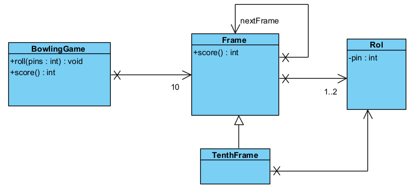

# Test Driven Development

protected = is private + subklasses toegang geven, package access

## Junit

### Oefening Weegschaal

#### Opgave


Je schrijft de test voor je een klasse implementeert.

#### Code
Domeinklasse
```java
package domein;

import java.math.BigInteger;

public class Weegschaal {

	private BigInteger gewicht = BigInteger.ZERO;

	public BigInteger getGewicht() {
		return this.gewicht;
	}

	public void vermeerder(BigInteger nieuwGewicht) {
		if (nieuwGewicht == null || nieuwGewicht.signum() < 0)
			throw new IllegalArgumentException("ongeldige waarde");
		gewicht = gewicht.add(nieuwGewicht);
	}
}
```
Testklasse
```java
package testen;

import java.math.BigInteger;

import org.junit.jupiter.api.Assertions;
//static wegdoen zorgt ervoor dat je assertions wel moet schrijven, 
//indien hij er wel staat moet je ze niet schrijven
import org.junit.jupiter.api.BeforeEach;
import org.junit.jupiter.api.Test;
import domein.Weegschaal;

class WeegschaalTest {

	private Weegschaal weegschaal;

	@BeforeEach
	public void before() { // de naam van de methode mag je zelf kiezen
		weegschaal = new Weegschaal();
	}

	@Test
	public void gewichtVermeerderen() {
		BigInteger gewicht = new BigInteger("15");
		// Weegschaal weegschaal = new Weegschaal();
		weegschaal.vermeerder(gewicht);
		Assertions.assertEquals(gewicht, weegschaal.getGewicht());
	}

	@Test
	public void nieuweWeegschaalGeeftGewichtNul() {
		// Weegschaal weegschaal = new Weegschaal();
		Assertions.assertEquals(BigInteger.ZERO, weegschaal.getGewicht());
	}

	@Test
	public void gewichtVermeerderenMetNegatieveWaarde() {
		BigInteger gewicht = new BigInteger("-20");
		Assertions.assertThrows(IllegalArgumentException.class, () -> weegschaal.vermeerder(gewicht));
	}

	@Test
	public void gewichtVermeerderenMetNull() {
		Assertions.assertThrows(IllegalArgumentException.class, () -> {
			weegschaal.vermeerder(null);
		});
	}
}
```

### Parameterized Test
Een test meerdere keren uitvoeren met verschillende paramters.  
Bv: We gaan volgende klasse testen
```java
package domain;
public class Calculator {
    public double add(double a, double b) {
        return a+b;
    }
}
```
We voorzien enkele testgevallen:  
1 + 1 = 2  
2,5 + 1 = 3,5  
3,1 + 1,1 = 4,2

```java 
package testen;
import org.junit.jupiter.api.Assertions;
import org.junit.jupiter.api.BeforeEach;
import org.junit.jupiter.params.ParameterizedTest;
import org.junit.jupiter.params.provider.CsvSource;

import domein.Calculator;

class CalculatorTest {
    private Calculator calculator;

    @BeforeEach
    public void before() {
        calculator = new Calculator();
    }

    @ParameterizedTest
    @CsvSource({"2.0, 1.0, 1.0", "3.5, 2.5, 1.0", "4.2, 3.1, 1.1"}) //csv=comma-separated values
    public void add(double expected, double valueOne, double valueTwo) {
        Assertions.assertEquals(expected, calculator.add(valueOne, valueTwo), 0);
    }
}
```

### Oefening 1


#### Opgave:

Formaat: 3cijfers-7cijfers-2cijfers  
De rest van de deling eerste tien cijfers door 97 moet gelijk zijn aan de twee laatste cijfers.

#### Code:
Domeinklasse:
```java
package domein;

public class Rekening {
	private String rekeningnummer;

	public Rekening(String rekeningnummer) {
		setRekeningnummer(rekeningnummer);
	}

	private void setRekeningnummer(String rekeningnummer) {
		if (rekeningnummer == null || rekeningnummer.isBlank()) {
			throw new IllegalArgumentException("rekeningnummer niet ingevuld");
		}

		if (!rekeningnummer.matches("\\d{3}-\\d{7}-\\d{2}")) {
			throw new IllegalArgumentException("rekeningnummer in verkeerd formaat");
		}
		
		String[] token = rekeningnummer.split("-");
		long eerste10Cijfers = Long.parseLong(token[0] + token[1]);
		long laatste2Cijfers = Long.parseLong(token[2]);

		if (eerste10Cijfers % 97L != laatste2Cijfers)
			throw new IllegalArgumentException("verkeerde cijfers in rekeningnummer");

		this.rekeningnummer = rekeningnummer;	
	}
}
```
Testklasse:
```java
package testen;

import ...

import domein.Rekening;

class RekeningTest {
	
	@ParameterizedTest
	@ValueSource(strings = {"063-1547563-60", "999-9999999-48", "001-0000001-77"})

	public void geldRekeningnummer(String rekeningnummer) {
		Assertions.assertDoesNotThrow(()->{
			new Rekening(rekeningnummer);
		});
	}
	
	@ParameterizedTest
	@NullAndEmptySource
	@ValueSource(strings = {"063-1547563-61", " ", "063-1547563"})
	
	public void ongeldigeRekeningnummer(String rekeningnummer) {
		Assertions.assertThrows(IllegalArgumentException.class, ()->{
			new Rekening(rekeningnummer);
		});
	}
	
	
	/*@Test
	public void nummerOk() {
		Assertions.assertDoesNotThrow(()->{
			new Rekening("063-1547563-60");
		});
	}
	
	@Test
	public void grootNummerOk() {
		Assertions.assertDoesNotThrow(()-> {
			new Rekening("999-9999999-48");
		});
	}*/
}
```

### Oefening Bowling

#### Opgave

  
The game consists of 10 frames as shown above.  In each frame the player hastwo opportunities to knock down 10 pins.  The score for the frame is the totalnumber of pins knocked down, plus bonuses for strikes and spares.  
A spare is when the player knocks down all 10 pins in two tries. The bonus forthat frame is the number of pins knocked down by the next roll.  Soin frame 3above, the score is 10 (the total number knocked down) plus a bonus of 5 (thenumber of pins knocked down on the next roll.)  
A strike is when the player knocks down all 10 pins on his first try.  The bonusfor that frame is the value of the next two balls rolled.  
In the tenth frame a player who rolls a spare or strike is allowed to roll the extraballs to complete the frame.  However no more than three balls can be rolled intenth frame.

Write a class named "BowlingGame" that has two methods:
- **roll(pins : int)** is called each time the player rolls a ball.  The argument is the number of pins knocked down.
- **score() : int** is called only at the very end of the game.  It returns the total score for that game.

Create a class **BowlingGame** and test **BowlingGameTest**

#### Ontwerp:


#### Code
Domeinklasse:
```java
package domain;
public class BowlingGame {
	
	private int rolls[] = new int[21];
	private int currentRoll = 0;

	public void roll(int pins) {
		rolls[currentRoll++] = pins;
		
	}

	public int score() {
		int score = 0;
		for(int frameIndex = 0, frame = 0;frame<10; frameIndex+=2, frame++) 
			if(isStrike(frameIndex)) {
				score += 10 + strikeBonus(frameIndex);
				frameIndex--;
			}
			else if(isSpare(frameIndex))
				score += 10 + spareBonus(frameIndex);
			else
				score += sumOfPinsInFrame(frameIndex);
		return score;
	}
	
	private int sumOfPinsInFrame(int frameIndex) {
		return  rolls[frameIndex] + rolls[frameIndex+1];
	}
	
	private int strikeBonus(int frameIndex) {
		return rolls[frameIndex+1] + rolls[frameIndex+2];
	}
	
	private int spareBonus(int frameIndex) {
		return rolls[frameIndex+2];
	}
	
	private boolean isStrike(int frameIndex) {
		return rolls[frameIndex]==10;
	}

	private boolean isSpare(int frameIndex) {
		return rolls[frameIndex] + rolls[frameIndex + 1] == 10;
	}
}
```
Testklasse:
```java
package tests;

import ...

import domain.BowlingGame;

class BowlingGameTest {
	
	private BowlingGame game;
	
	@BeforeEach
	public void before() {
		game = new BowlingGame();
	}
	
	private void rollMany(int n, int pins) {
		for(int i=0;i<n;i++) game.roll(pins);
	}
	
	private void rollSpare() {
		game.roll(5);
		game.roll(5);
	}
	
	private void rollStrike() {
		game.roll(10);
	}
	
	@ParameterizedTest
	@CsvSource({"0,0","1,20"})
	public void testSameNumberOfPins(int number, int expexted) {
		rollMany(20, number);
		Assertions.assertEquals(expexted, game.score());
	}
	
	@Test
	public void testOneSpare() {
		rollSpare();
		game.roll(3);
		rollMany(17, 0);
		Assertions.assertEquals(16, game.score());
	}
	
	@Test
	public void testTwoSpare() {
		rollSpare();
		rollSpare();
		game.roll(3);
		rollMany(15, 0);
		Assertions.assertEquals(31, game.score());
	}

	@Test
	public void testOneStrike() {
		rollStrike();
		game.roll(3);
		game.roll(4);
		rollMany(16, 0);
		Assertions.assertEquals(24, game.score());
	}
	
	@Test
	public void testAllStrikes() {
		for(int i = 0; i<12; i++) rollStrike();
		Assertions.assertEquals(300, game.score());
	}
	
	@Test 
	void testAllSpares_5_5() {
		for(int i = 0; i<10; i++) rollSpare();
		game.roll(5);
		Assertions.assertEquals(150, game.score());
	}
	
	@Test
	public void testScenario() {
		int[] pins = {1,4,4,5,6,4,5,5,10,0,1,7,3,6,4,10,2,8,6};
		for(int i=0; i<pins.length;i++) game.roll(pins[i]);
		Assertions.assertEquals(133, game.score());
	}
	
}
```

## Mockito

### Oefening 

#### Opgave


#### Oplossing
De testen klassen
```java
package domein;

import persistentie.PersistentieController;

public class ContinentService {

	private static final int PER_1000_INWONERS = 1000;
	
	private PersistentieController persistentieController; //STAP1
	
	public ContinentService () { // STAP3
		this(new PersistentieController());
	}
	
	public ContinentService(PersistentieController persistentieController) { //STAP3
		this.persistentieController = persistentieController;
	}

	public double geefGeboorteOverschot(String continent) {
		if (continent == null || continent.isBlank()) {
			throw new IllegalArgumentException("continent moet ingevuld zijn");
		}
		//PersistentieController persistentieController = new PersistentieController(); //STAP4
		long aantalInwoners = persistentieController.findAantalBewoners(continent);
		if (aantalInwoners <= 0) {
			throw new IllegalArgumentException("geen inwoners gevonden voor gegeven continent");
		}

		long aantalSterfgevallen = persistentieController.findSterfteCijfer(continent);
		long aantalGeboorten = persistentieController.findGeboortecijfers(continent);
		if(aantalSterfgevallen<0|| aantalGeboorten<0) {
			throw new IllegalArgumentException();
		}

		double geboortecijfer = (double) aantalGeboorten / aantalInwoners * PER_1000_INWONERS;
		double sterftecijfer = (double) aantalSterfgevallen / aantalInwoners * PER_1000_INWONERS;

		return geboortecijfer - sterftecijfer;
	}
}
```

Testklasse
```java
package testen;

import static org.junit.jupiter.api.Assertions.*;

import java.util.stream.Stream;

import ...

import domein.ContinentService;
import persistentie.PersistentieController;

@ExtendWith(MockitoExtension.class)
class ContinentServiceTest {
	@Mock
	private PersistentieController persistentController;
	@InjectMocks
	private ContinentService continentService;
	
	private static final String CODE = "Code";
	
	@Test
	public void testGeboorteOverschot() {
		//trainen
		dummyTrainen(16405399L, 184634L, 135136L);
		//assert en controle
		controle(3.01);
	}
	
	@Test
	public void testSterfteOverschot() {
		dummyTrainen(18506500L, 277597L, 333117L);
		controle(-3);
	}
	
	private void dummyTrainen(long aantalInwoners, long aantalGeboorten, long aantalStergevallen) {
		
		Mockito.lenient().when(persistentController.findAantalBewoners(CODE)).thenReturn(aantalInwoners);
		Mockito.lenient().when(persistentController.findGeboortecijfers(CODE)).thenReturn(aantalGeboorten);
		Mockito.lenient().when(persistentController.findSterfteCijfer(CODE)).thenReturn(aantalStergevallen);
	}
	
	private void controle(double verwachteResultaat) {
		double geboorteOverschot = continentService.geefGeboorteOverschot(CODE);
		Assertions.assertEquals(verwachteResultaat, geboorteOverschot, 0.01);
		Mockito.verify(persistentController).findAantalBewoners(CODE);
		Mockito.verify(persistentController).findGeboortecijfers(CODE);
		Mockito.verify(persistentController).findSterfteCijfer(CODE);
	}
	
	//100% cover
	@ParameterizedTest
	@NullAndEmptySource
	@ValueSource(strings = " ")
	public void legeSpatieNullContinent(String continent) {
		Assertions.assertThrows(IllegalArgumentException.class, 
				() -> continentService.geefGeboorteOverschot(continent));
	}
	
	//CSVsource werkt niet met long constante vb 123L
	//dus method source
	private static Stream<Arguments> opsommingOngeldigeWaarden(){
		return Stream.of(
				Arguments.of(0L, 100L, 100L), 
				Arguments.of(-1L, 100L, 100L),
				Arguments.of(100L, -1L, 100L),
				Arguments.of(100L, 100L, -1L));
	}
	
	@ParameterizedTest
	@MethodSource("opsommingOngeldigeWaarden")
	public void ongeldigeWaarden(long aantalInwoners, long aantalGeboorten, long aantalStergevallen) {
		dummyTrainen(aantalInwoners, aantalGeboorten, aantalStergevallen);
		Assert.assertThrows(IllegalArgumentException.class, 
				() -> continentService.geefGeboorteOverschot(CODE));
	}

	private static Stream<Arguments> randWaarden(){
		return Stream.of(
				Arguments.of(1L, 15L, 14L, 1000.0), 
				Arguments.of(30000L, 0L, 15020L, -500.66),
				Arguments.of(30000L, 15020L, 0L, 500.66),
				Arguments.of(1L, 0L, 0L, 0));
	}
	@ParameterizedTest
	@MethodSource("randWaarden")
	public void geldigeWaarden(long aantalInwoners, long aantalGeboorten, long aantalStergevallen, double verwachtResultaat) {
		dummyTrainen(aantalInwoners, aantalGeboorten, aantalStergevallen);
		controle(verwachtResultaat);
	}
}
```